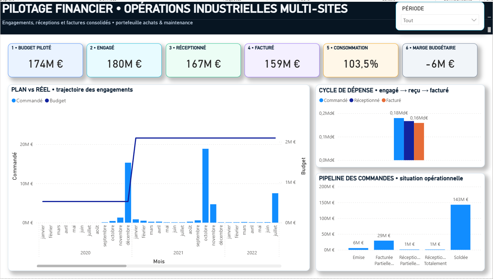

# Jefferson Mawapanga Saku — Data & Power BI Portfolio

This portfolio presents projects focused on **Power BI, financial monitoring, procurement analytics, operational reporting, data modelling and business intelligence**.

The goal is to demonstrate not only dashboard design, but also the full analytical workflow behind a professional reporting solution: **data preparation, Power Query, DAX, KPI design, data modelling, financial analysis, UX/UI and decision-support reporting**.

All public projects use **synthetic and anonymised data** created specifically for portfolio purposes.

---

# 🇬🇧 ENGLISH

## Projects

### 01 — Financial Monitoring Report — Multitechnical & Multiservice Operations

➡️ [Open the project](./powerbi-financial-monitoring-multitechnical-multiservice/)

### Dashboard preview

**EN —** Executive financial overview combining budget, commitments, receipts, invoicing, budget consumption and operational order status in a single management view.

**FR —** Vue exécutive consolidant budget, engagements, réceptions, facturation, consommation budgétaire et statut opérationnel des commandes.

This Power BI report simulates the financial monitoring of a **large multi-site multitechnical and multiservice operating environment**.

The dashboard is designed for activities such as technical maintenance, facility operations, energy and utilities services, subcontracted works, technical purchases and recurring multiservice contracts.

It provides finance, procurement and operations teams with a consolidated view of:

- annual and monthly budget consumption;
- purchase commitments;
- purchase orders;
- goods and services received;
- supplier invoicing;
- overdue and pending financial exposure;
- supplier concentration;
- operational status of commitments;
- detailed transaction-level analysis.

The report combines an **executive financial overview** with detailed operational analysis so that managers can move from a global KPI to the underlying transactions.

### Business value

The report helps answer practical management questions such as:

- Are commitments aligned with the available budget?
- Which activities or suppliers represent the largest financial exposure?
- How much has been ordered, received and invoiced?
- Which commitments are still open or only partially completed?
- Is budget consumption accelerating abnormally?
- Which transactions require operational or financial follow-up?

### Portfolio environment

The synthetic dataset reproduces a realistic large-scale operating context with:

- **4,636 transaction lines**
- **68 suppliers**
- **18 operational sites**
- **4 operating regions**
- multi-year history from 2020 to 2026
- approximately **€29.0M committed in 2026 YTD**
- approximately **€25.6M received**
- approximately **€23.8M invoiced**
- approximately **€2.3M overdue / pending**

### Technologies demonstrated

**Power BI Desktop · DAX · Power Query / M · Excel · Data modelling · Financial KPI design · Procurement analytics · Dashboard UX/UI**

> All company names, suppliers, sites, employees, projects and financial data are fictional. No confidential employer, customer or government information is published.

---

# 🇫🇷 FRANÇAIS

## Projets

### 01 — Rapport de suivi financier — Activités Multitechniques & Multiservices

➡️ [Ouvrir le projet](./powerbi-financial-monitoring-multitechnical-multiservice/)

Ce rapport Power BI simule le **suivi financier d'un grand environnement d'exploitation multitechnique et multiservice multi-sites**.

Le dashboard est conçu pour des activités telles que la maintenance technique, l'exploitation de sites, les utilités et l'énergie, les travaux sous-traités, les achats techniques et les contrats de services récurrents.

Il permet aux équipes finance, achats et exploitation de suivre de manière consolidée :

- la consommation du budget annuel et mensuel ;
- les engagements de dépenses ;
- les commandes fournisseurs ;
- les prestations et matériels réceptionnés ;
- la facturation fournisseurs ;
- les montants échus ou restant à traiter ;
- la concentration des dépenses par fournisseur ;
- l'état opérationnel des engagements ;
- le détail transactionnel des commandes.

Le rapport combine une **vision financière de synthèse** et une analyse opérationnelle détaillée afin de passer rapidement d'un KPI global aux transactions qui l'expliquent.

### Valeur métier

Le rapport permet notamment de répondre aux questions suivantes :

- Les engagements restent-ils cohérents avec le budget disponible ?
- Quels fournisseurs ou activités représentent l'exposition financière la plus importante ?
- Quel montant a été commandé, réceptionné puis facturé ?
- Quels engagements sont encore ouverts ou partiellement exécutés ?
- La consommation budgétaire présente-t-elle une dérive ?
- Quelles transactions nécessitent une action de suivi ?

### Environnement du portfolio

Le jeu de données synthétique reproduit un contexte d'exploitation réaliste à grande échelle avec :

- **4 636 lignes de transactions**
- **68 fournisseurs**
- **18 sites opérationnels**
- **4 régions opérationnelles**
- un historique pluriannuel de 2020 à 2026
- environ **29,0 M€ engagés en 2026 YTD**
- environ **25,6 M€ réceptionnés**
- environ **23,8 M€ facturés**
- environ **2,3 M€ échus / en attente**

### Technologies démontrées

**Power BI Desktop · DAX · Power Query / M · Excel · Modélisation de données · KPI financiers · Analyse achats · UX/UI de dashboard**

> Tous les noms de sociétés, fournisseurs, sites, collaborateurs, projets et données financières sont fictifs. Aucune donnée confidentielle d'employeur, de client ou d'organisme public n'est publiée.
