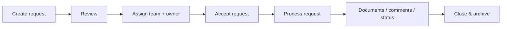
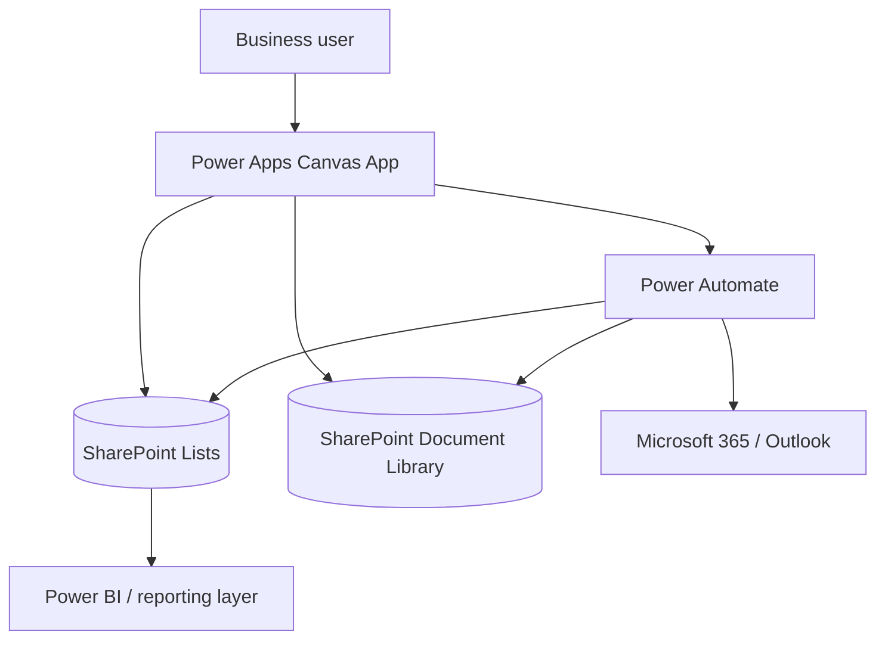

# ProcureFlow — Power Platform Procurement Workflow Portfolio


A **sanitised portfolio reconstruction of an enterprise procurement and request-management platform** built with Microsoft Power Platform.

The project demonstrates how I structure a business application across **Power Apps, Power Fx, Power Automate, SharePoint and Microsoft 365** while keeping the public portfolio free of production data, tenant URLs, company branding and confidential implementation details.

> **Portfolio boundary:** the production `.msapp`, production flows, tenant identifiers, real users, real suppliers and confidential data are intentionally **not published**. This repository documents the architecture, UX, functional scope and representative technical patterns.

---

## Demo

### Video

**Coming soon:** upload the final walkthrough here:

`demo/procureflow-demo.mp4`

The repository already contains a recording guide in [`demo/README.md`](demo/README.md).

### Screenshots

The screenshot locations are already prepared in [`assets/README.md`](assets/README.md).

Planned files:

| # | Screen | File to upload |
|---|---|---|
| 01 | Home / navigation | `assets/01-home.png` |
| 02 | Create request | `assets/02-create-request.png` |
| 03 | Request review | `assets/03-request-review.png` |
| 04 | My tickets | `assets/04-my-tickets.png` |
| 05 | Team tickets | `assets/05-team-tickets.png` |
| 06 | Ticket detail | `assets/06-ticket-detail.png` |
| 07 | Documents | `assets/07-documents.png` |
| 08 | Team management | `assets/08-team-management.png` |
| 09 | SharePoint browser | `assets/09-sharepoint-browser.png` |
| 10 | Email / conversation panel | `assets/10-email-panel.png` |

Once these files are uploaded, they can be embedded directly into this README without exposing the application package.

---

## Business problem

Procurement and operational teams often manage requests through fragmented email threads, spreadsheets and manual follow-up. This makes ownership, status tracking, document history and accountability difficult to maintain.

This solution centralises the workflow into a single application covering:

- request creation and structured business forms;
- review before submission;
- assignment to a team and an individual owner;
- acceptance and processing;
- status tracking and audit history;
- documents and supporting files;
- comments and stakeholder visibility;
- team membership and access management;
- notifications and workflow orchestration;
- request closure and archive behaviour.

---

## End-to-end workflow



The application supports several procurement-oriented request types while keeping a consistent lifecycle and navigation model.

---

## Solution architecture



### Public portfolio mode

The public demonstration is designed around **synthetic data and simulated interactions**. It does not require access to the original tenant or production connectors.

### Enterprise implementation pattern

The enterprise architecture separates:

1. **Presentation and interaction** — Power Apps Canvas App
2. **Business data** — SharePoint lists
3. **Documents** — SharePoint document library
4. **Workflow orchestration** — Power Automate
5. **Notifications / collaboration** — Microsoft 365 services
6. **Reporting** — Power BI where required

See [`docs/ARCHITECTURE.md`](docs/ARCHITECTURE.md) for more detail.

---

## Main capabilities

- Responsive left-navigation application shell
- Role-aware user experience
- Multi-step request creation
- Validation and review before submission
- Team + individual assignment
- Ticket acceptance workflow
- Personal and team ticket queues
- Request status lifecycle
- Attachments and document management
- Comments and history
- CC / stakeholder visibility
- Email and conversation integration patterns
- SharePoint document navigation patterns
- Team membership and delegation administration
- User profile / access management
- Archiving behaviour after closure
- Error-aware transaction patterns
- Environment-aware ALM design principles

More detail: [`docs/FEATURES.md`](docs/FEATURES.md)

---

## Engineering principles demonstrated

This portfolio is intended to show more than UI building.

### Power Apps / Power Fx

- source-side filtering where possible;
- delegation-aware design;
- reduced unnecessary network calls;
- reusable components and containers;
- explicit error handling around writes;
- controlled navigation and state;
- avoidance of large local copies of remote datasets;
- synthetic local collections only for the public demo experience.

### Power Automate

- workflow separation by responsibility;
- structured scopes and failure paths;
- idempotency considerations;
- duplicate-prevention logic;
- server-side validation for sensitive operations;
- controlled retries and concurrency;
- no secrets embedded in the application.

### SharePoint

- SharePoint permissions are treated as the security boundary, not UI visibility;
- document storage is separated from request metadata;
- list design considers indexing, filtering and scale;
- unique permissions are kept under control.

### ALM

The production-oriented design follows a **DEV → TEST → PROD** lifecycle with solutions, connection references and environment-specific configuration rather than hard-coded production URLs.

Microsoft reference material:

- [Power Platform ALM overview](https://learn.microsoft.com/en-us/power-platform/alm/overview-alm)
- [Power Platform solution concepts](https://learn.microsoft.com/en-us/power-platform/alm/solution-concepts-alm)
- [Environment variables in Power Platform](https://learn.microsoft.com/en-us/power-apps/maker/data-platform/environmentvariables)
- [Data-source environment variables in canvas apps](https://learn.microsoft.com/en-us/power-apps/maker/data-platform/environmentvariables-data-source-canvas-apps)
- [Delegation overview for canvas apps](https://learn.microsoft.com/en-us/power-apps/maker/canvas-apps/delegation-overview)

---

## Public technical samples

The repository includes **representative, sanitised examples** rather than exported production source:

- [`samples/PowerFx_examples.md`](samples/PowerFx_examples.md)
- [`samples/PowerAutomate_architecture.md`](samples/PowerAutomate_architecture.md)
- [`samples/SharePoint_schema.md`](samples/SharePoint_schema.md)

These samples are intentionally generic and do not contain production IDs, URLs or confidential business rules.

---

## Repository structure

```text
.
├── README.md
├── NOTICE.md
├── .gitignore
├── assets/
│   └── README.md
├── demo/
│   └── README.md
├── docs/
│   ├── ARCHITECTURE.md
│   ├── FEATURES.md
│   └── SECURITY_AND_ALM.md
└── samples/
    ├── PowerFx_examples.md
    ├── PowerAutomate_architecture.md
    └── SharePoint_schema.md
```

---

## What this project demonstrates to a technical reviewer

A reviewer can evaluate my ability to move from a business need to a structured Power Platform solution: data model, application architecture, workflow orchestration, security considerations, UX, maintainability and ALM.

The full production application is deliberately kept private. A **sanitised demo can be presented during an interview or freelance discussion**.

---

## Résumé FR

Cette vitrine présente une **reconstruction anonymisée d'une plateforme de gestion des demandes achats** réalisée avec Power Apps, Power Fx, Power Automate, SharePoint et Microsoft 365.

Le dépôt public montre l'architecture, les fonctionnalités, les choix techniques et des exemples anonymisés. Le `.msapp` de production, les flows réels, les URLs du tenant, les données utilisateurs et les informations confidentielles ne sont pas publiés.

La vidéo et les captures seront ajoutées dans les dossiers `demo/` et `assets/` déjà préparés.
