# Jefferson Mawapanga Saku — Power Platform Engineer

> **I build business applications and workflow automation with Power Apps, Power Automate and SharePoint.**

[🇬🇧 English](#english) · [🇫🇷 Français](#francais) · [▶ Watch the Power Apps demo](https://www.youtube.com/watch?v=Y15BCn_i-fo)

## 30-second Power Platform portfolio

[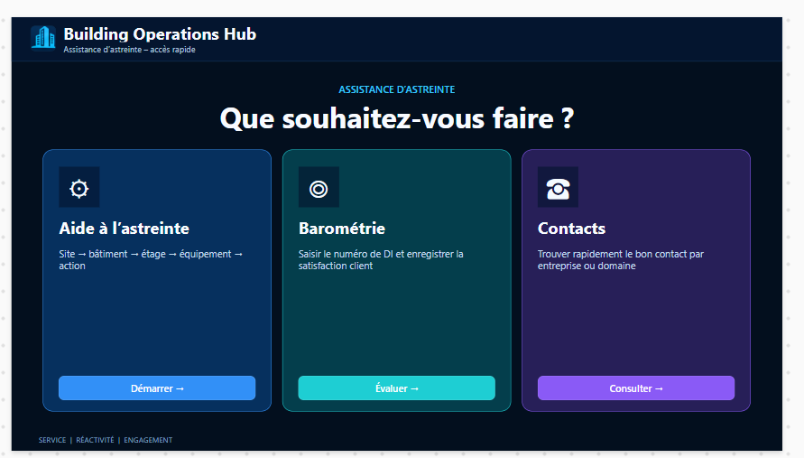](https://www.youtube.com/watch?v=Y15BCn_i-fo)

### Building Operations Hub

**Power Apps · Power Automate · SharePoint · Power Fx**

Responsive field application for maintenance operations, on-call support, equipment procedures, technical contacts and intervention feedback.

**[▶ Watch the demo](https://www.youtube.com/watch?v=Y15BCn_i-fo)** · **[Open the full case study](./projects/building-operations-hub/)**

---

# Building Operations Hub — full visual walkthrough

The quick view above is intentionally short. Below is the complete application journey with the main screens and capabilities.

### 1. Operations hub / Hub opérationnel

One operational entry point for on-call assistance, intervention feedback and technical contacts.

### 2. Site selection / Choix du site

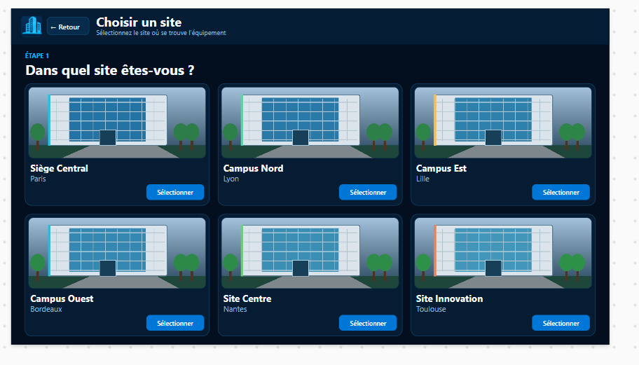

Visual multi-site navigation designed for fast field use.

### 3. Building selection / Choix du bâtiment

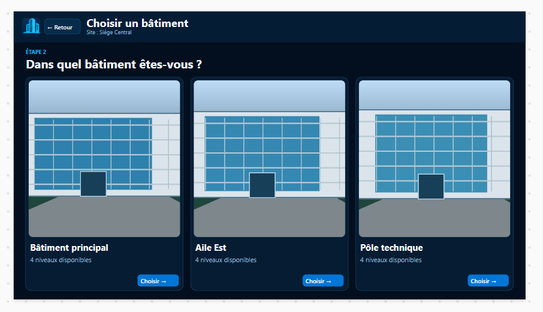

The site context is preserved while the user moves to the relevant building.

### 4. Floor or technical zone / Étage ou zone technique

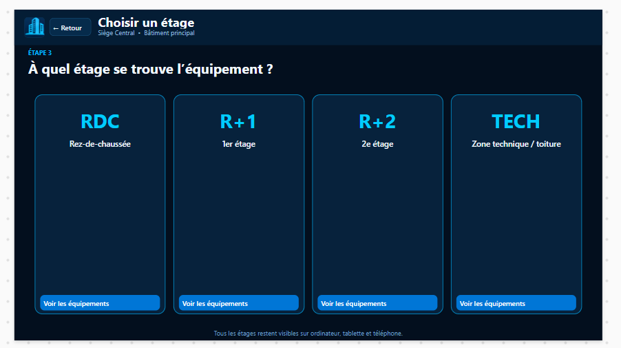

The navigation follows the real physical hierarchy of the facility.

### 5. Equipment library / Bibliothèque équipements

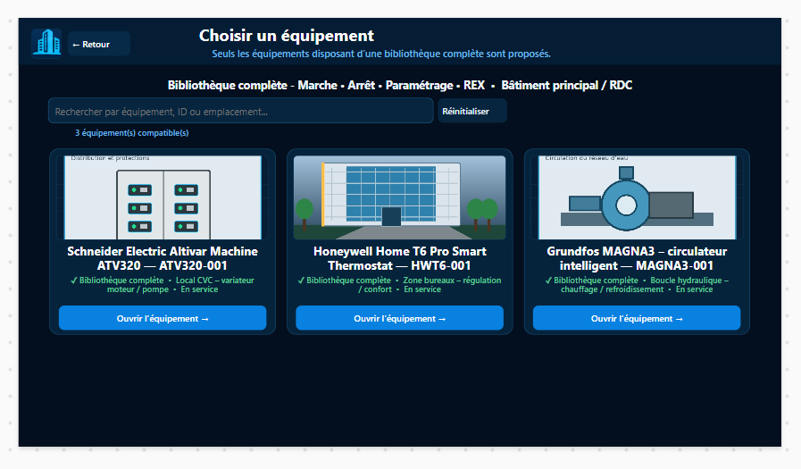

Search and filters help the user reach the correct equipment while keeping its technical context visible.

### 6. Equipment action hub / Actions équipement

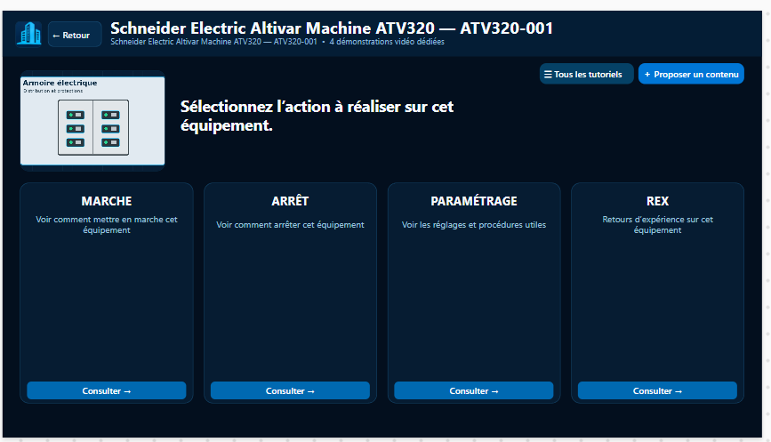

Each asset gives direct access to **Start, Stop, Configuration, troubleshooting / lessons learned and additional tutorials**.

### 7. Start procedure / Procédure de mise en service

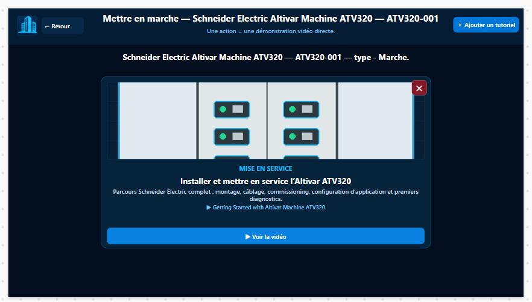

Dedicated technical guidance is attached to the selected equipment and action.

### 8. Configuration library / Bibliothèque de paramétrage

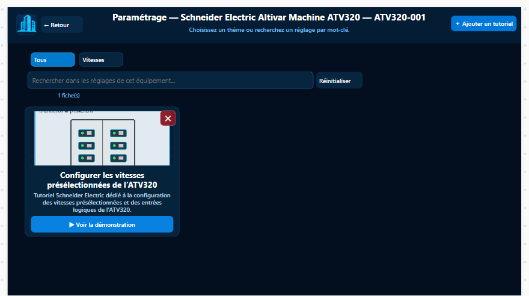

Multiple configuration tutorials can be searched and managed independently for the same equipment.

### 9. Troubleshooting & lessons learned / Dépannage & REX

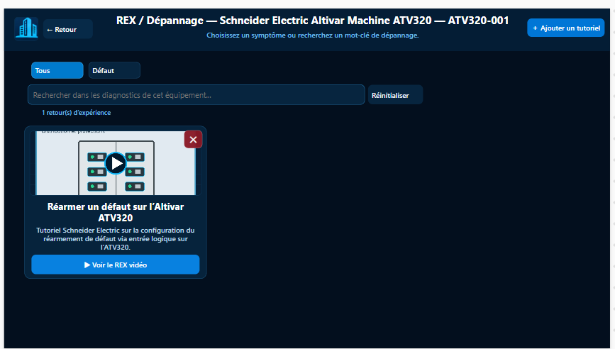

Operational feedback is structured as reusable knowledge instead of remaining in informal notes.

### 10. Technical contact directory / Annuaire technique

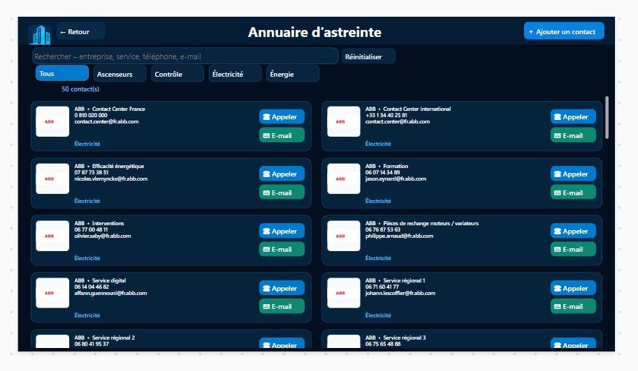

Users can quickly find the right company, service, phone number or e-mail.

### 11. Intervention reference / Référence intervention

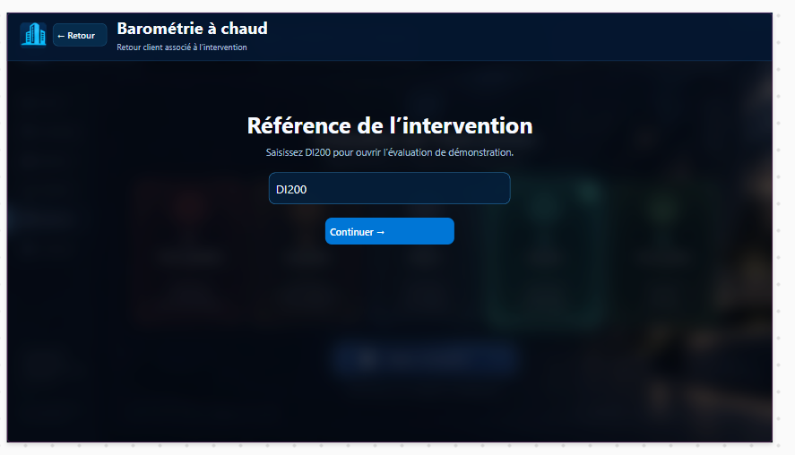

Feedback is linked to an intervention context before submission.

### 12. Technical-content proposal / Proposition de contenu

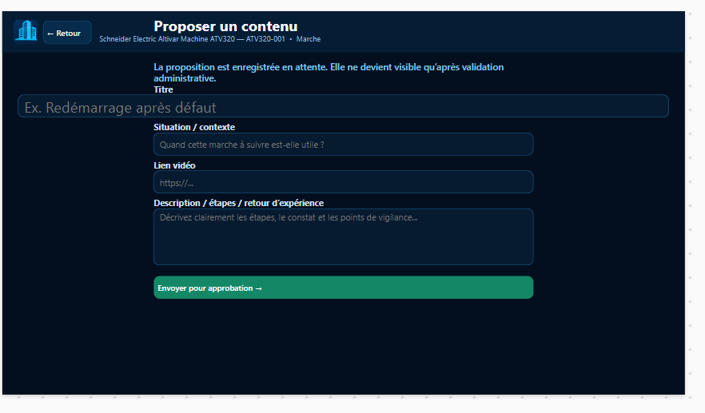

Users can propose new technical knowledge without publishing it directly.

### 13. Post-intervention feedback / Retour après intervention

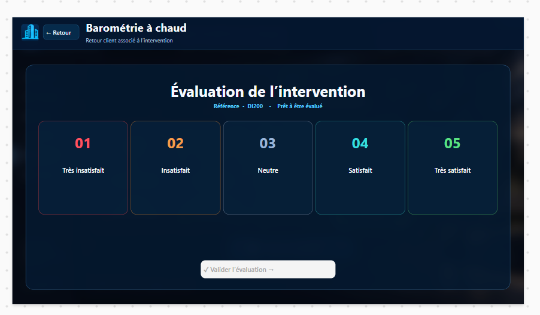

A simple rating captures immediate service feedback for later operational analysis.

---

# 🇬🇧 English

## What I can deliver

| Business need | What I build |
|---|---|
| **Operational applications** | Responsive Power Apps Canvas applications for field and business teams |
| **Workflow automation** | Power Automate flows for approvals, notifications, lifecycle management and repetitive tasks |
| **Data & document solutions** | SharePoint lists and libraries structured for business data, documents and controlled access |
| **Business process digitalisation** | End-to-end solutions from user input to processing, tracking and controlled completion |
| **Enterprise-ready design** | Delegation-aware patterns, explicit error handling, security principles and ALM |

## Building Operations Hub

A multi-site maintenance and on-call support application that centralises equipment procedures, troubleshooting knowledge, technical contacts, governed technical-content proposals and post-intervention feedback.

**Business journey:**

**Site → Building → Floor / Zone → Equipment → Action / Tutorial**

**Technology:** Power Apps Canvas · Power Fx · Power Automate · SharePoint · Microsoft 365

**[▶ Watch the full YouTube demo](https://www.youtube.com/watch?v=Y15BCn_i-fo)** · **[Open the dedicated case study](./projects/building-operations-hub/)**

## Engineering approach

I design Power Platform solutions around the complete business workflow, not only the interface:

**Business need → Process → Data model → Power Apps → Power Automate → SharePoint → Security → ALM**

The project documents responsive design, source-side/delegation-aware patterns, explicit error handling, controlled actions, role-based access principles and DEV → TEST/UAT → PROD deployment practices.

## Architecture

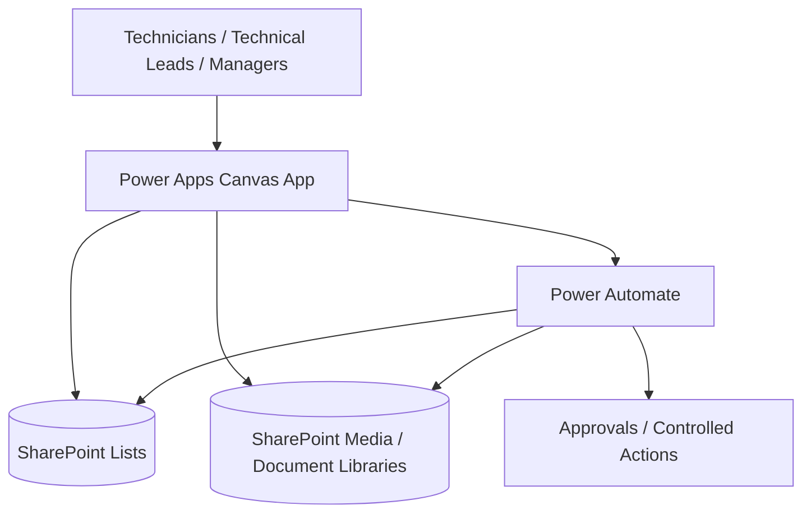

## Public portfolio boundary

The public repository uses sanitised or synthetic information. Production tenant URLs, credentials, confidential datasets, production source packages and sensitive connection details are not published.

---

# 🇫🇷 Français

## Ce que je peux apporter

| Besoin | Solution |
|---|---|
| **Applications métiers** | Applications Power Apps Canvas responsives pour équipes terrain et fonctions support |
| **Automatisation** | Flows Power Automate pour validations, notifications, cycles de vie et tâches répétitives |
| **Données & documents** | Architecture SharePoint pour données métiers, documents et accès maîtrisés |
| **Digitalisation des processus** | Solutions de bout en bout, de la saisie utilisateur jusqu'au traitement et au suivi |
| **Conception entreprise** | Délégation, gestion explicite des erreurs, sécurité, gouvernance et ALM |

## Building Operations Hub

Application Power Apps responsive pour la maintenance et l'astreinte, avec procédures équipements, dépannage / REX, annuaire technique, proposition de nouveaux contenus et retour après intervention.

**Parcours métier :**

**Site → Bâtiment → Étage / Zone → Équipement → Action / Tutoriel**

**Technologies :** Power Apps Canvas · Power Fx · Power Automate · SharePoint · Microsoft 365

**[▶ Voir la démonstration YouTube](https://www.youtube.com/watch?v=Y15BCn_i-fo)** · **[Voir l'étude de cas complète](./projects/building-operations-hub/#francais)**

## Approche

Je construis les solutions autour du processus métier complet :

**Besoin métier → Processus → Modèle de données → Power Apps → Power Automate → SharePoint → Sécurité → ALM**

Le projet documente l'UX responsive, les principes de délégation et de traitement côté source, la gestion explicite des erreurs, les actions contrôlées, la sécurité par rôles et le cycle DEV → TEST/UAT → PROD.

Les versions publiques utilisent des données anonymisées ou synthétiques et n'exposent pas les éléments confidentiels des environnements de production.

---

## Separate Power BI portfolio

My Power BI work is intentionally kept in a separate repository so the Power Platform and Business Intelligence portfolios stay clear and focused.

**[Open the separate Power BI portfolio →](https://github.com/jeffersonkuku/powerbi-portfolio-projects)**
