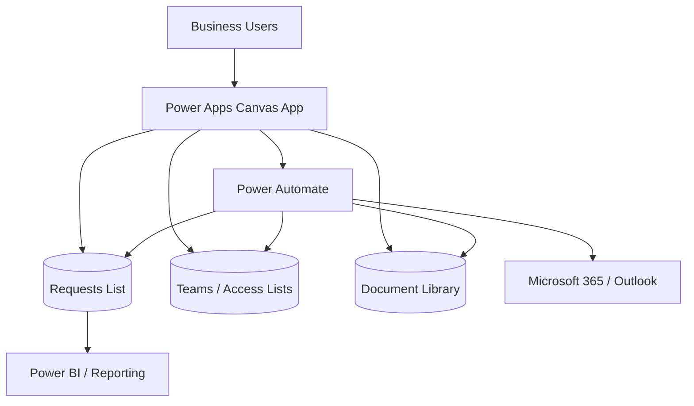
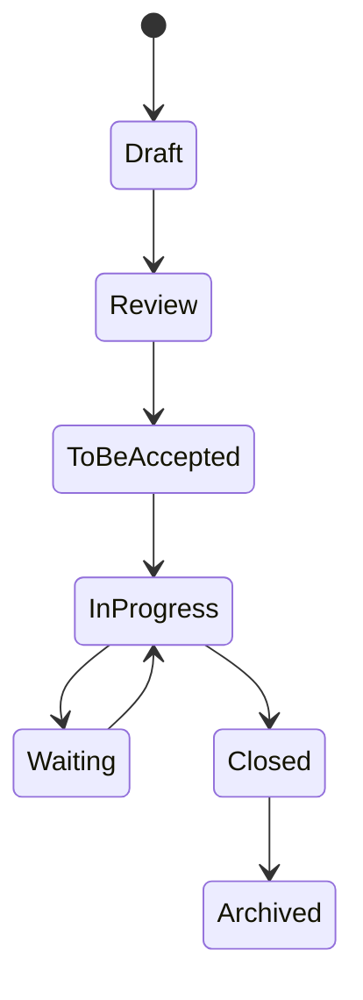

# Solution Architecture

## Overview

ProcureFlow is presented as a multi-layer Microsoft Power Platform solution rather than a standalone canvas application.

## Layer responsibilities

### 1. Power Apps — presentation and interaction

The canvas app is responsible for:

- navigation and responsive screen composition;
- business-form interaction;
- user feedback and client-side validation;
- displaying personal and team work queues;
- request detail, history and document UX;
- invoking workflow operations when server-side orchestration is required.

It should not be treated as the security boundary for protected data.

### 2. SharePoint — business data

SharePoint lists provide structured storage for requests, teams, memberships, copies / stakeholders, history and configuration where appropriate.

The implementation pattern favours source-side filtering and indexed columns rather than downloading full lists into the application.

### 3. SharePoint document library — files

Request documents are stored separately from list metadata so that documents can follow the request lifecycle while remaining manageable as files.

A stable request identifier is used to associate files with their parent request.

### 4. Power Automate — orchestration

Cloud flows handle operations that are better executed server-side, for example:

- notifications;
- document operations;
- request transmission;
- lifecycle events;
- archiving;
- integration-oriented actions;
- duplicate-prevention and validation logic.

Flows are separated by responsibility to make failures easier to diagnose and maintain.

### 5. Microsoft 365 — collaboration

Microsoft 365 services can support people lookup, email notifications and conversation-oriented workflows. The public portfolio does not expose production connection details.

### 6. Reporting

Operational reporting can consume the request data model without coupling the reporting layer to the application UI.

---

# Demo architecture vs enterprise architecture

## Public portfolio demo

The public demo uses **synthetic information** and can simulate actions that would normally call external connectors or Power Automate.

This is intentional. The portfolio goal is to demonstrate:

- the user journey;
- information architecture;
- Power Platform solution design;
- business logic;
- UX and maintainability decisions.

It is not intended to reproduce a production tenant publicly.

## Enterprise deployment

A production implementation should use environment-aware configuration, solution components and connection references so that DEV, TEST and PROD values are not hard-coded into application formulas.

Microsoft references:

- https://learn.microsoft.com/en-us/power-platform/alm/overview-alm
- https://learn.microsoft.com/en-us/power-platform/alm/solution-concepts-alm
- https://learn.microsoft.com/en-us/power-apps/maker/data-platform/environmentvariables
- https://learn.microsoft.com/en-us/power-apps/maker/data-platform/environmentvariables-data-source-canvas-apps

---

# Request lifecycle

Exact labels can vary by implementation, but the important design principle is a controlled lifecycle with explicit ownership and traceability.

---

# Architecture qualities demonstrated

- separation of UI, data, documents and orchestration;
- least-privilege-oriented design;
- delegation-aware query thinking;
- explicit lifecycle states;
- error handling around writes and workflow calls;
- reduced client-side fan-out;
- reusable navigation/components;
- synthetic demo mode isolated from production configuration;
- DEV → TEST → PROD ALM mindset.
