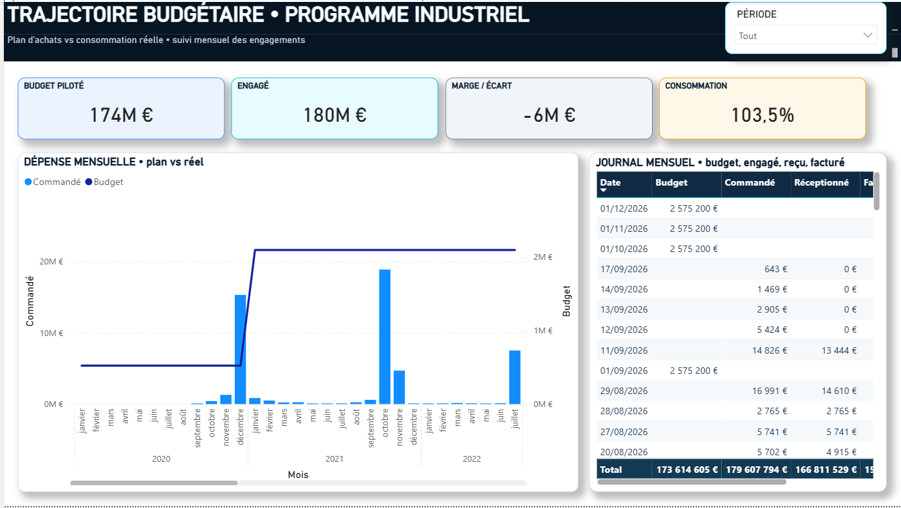
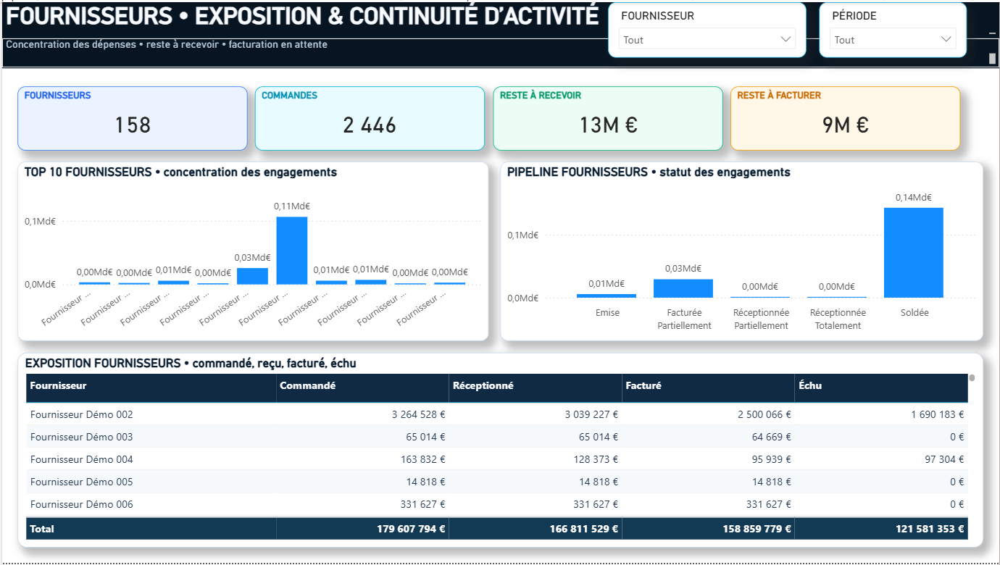
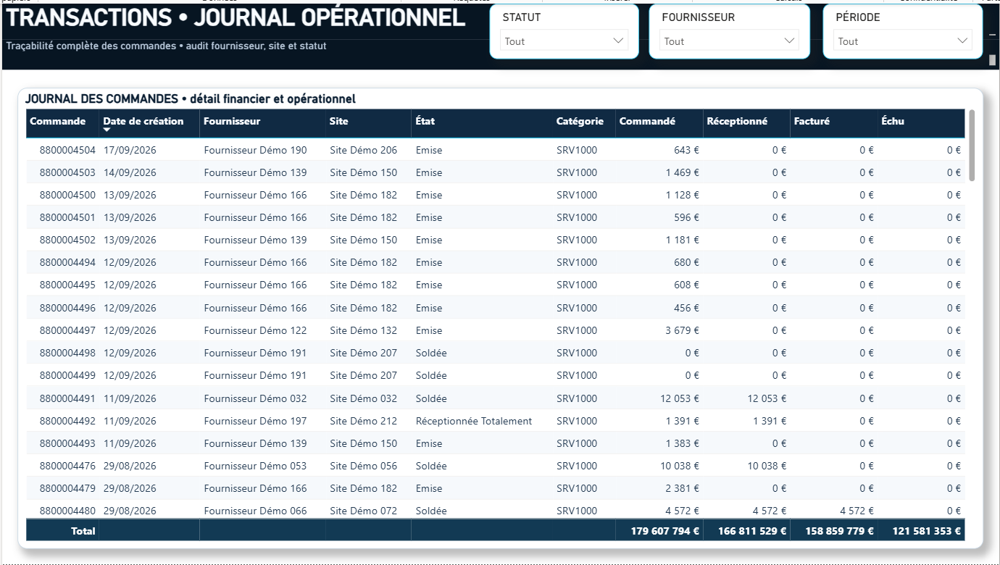

# Financial Monitoring Report — Multitechnical & Multiservice Operations

A Power BI portfolio project dedicated to **financial monitoring for large multi-site multitechnical and multiservice operations**.

---

## Professional context / Contexte professionnel

**EN —** This portfolio project is based on financial-monitoring and operational-reporting work carried out during my professional experience at **ENGIE Solutions**, in a multitechnical and multiservice environment. The public version is not an internal ENGIE file: it is a confidentiality-safe reconstruction that preserves the type of business problems, analytical logic and Power BI work performed in a real professional context.

**FR —** Ce projet de portfolio est basé sur des travaux de suivi financier et de reporting opérationnel réalisés dans le cadre de mon expérience professionnelle chez **ENGIE Solutions**, dans un environnement multitechnique et multiservice. La version publique n'est pas un fichier interne ENGIE : il s'agit d'une reconstruction respectant la confidentialité, qui conserve les problématiques métier, la logique d'analyse et les compétences Power BI mobilisées dans un contexte professionnel réel.

For confidentiality reasons / Pour des raisons de confidentialité :

- client names and identities are not published / les noms et identités des clients ne sont pas publiés ;
- internal systems and URLs are removed / les systèmes et URLs internes sont supprimés ;
- contractual and commercially sensitive information is excluded / les informations contractuelles et commercialement sensibles sont exclues ;
- supplier, site and financial data shown publicly are anonymised or synthetic / les données fournisseurs, sites et financières publiées sont anonymisées ou synthétiques ;
- the screenshots below are from the public portfolio reconstruction, not internal production screenshots / les captures ci-dessous proviennent de la reconstruction publique du portfolio et non d'écrans internes de production.

---

## Dashboard preview / Aperçu du rapport

The screenshots below are taken from the actual portfolio report. The Power BI Desktop interface has only been cropped out for a cleaner GitHub presentation; the dashboard content itself has not been altered.

Les captures ci-dessous proviennent directement du rapport du portfolio. Seule l'interface Power BI Desktop autour du rapport a été recadrée pour une présentation GitHub plus propre ; le contenu du dashboard n'a pas été modifié.

### 1 — Financial 360° Overview / Vue financière 360°

**EN — Purpose in the professional workflow:** this page was designed as the management entry point for financial steering. It was used to give a rapid consolidated view of budget, commitments, receipts, invoicing, consumption rate and remaining budget, while also showing whether the order pipeline was progressing normally from commitment to receipt and invoicing. The objective was to identify a financial drift or an operational blockage quickly before moving into the detailed views.

**FR — Utilité dans le workflow professionnel :** cette page servait de point d'entrée pour le pilotage financier. Elle permettait d'obtenir rapidement une vision consolidée du budget, des engagements, des réceptions, de la facturation, du taux de consommation et de la marge budgétaire, tout en vérifiant que le cycle des commandes évoluait normalement de l'engagement jusqu'à la réception puis à la facturation. L'objectif était d'identifier rapidement une dérive financière ou un blocage opérationnel avant d'aller dans les vues de détail.

---

### 2 — Budget Trajectory / Trajectoire budgétaire

**EN — Purpose in the professional workflow:** this view was used to monitor the budget trajectory over time and compare planned financial capacity with actual commitments. It helped identify months with unusually high purchasing activity, anticipate budget overruns, follow the gap between committed, received and invoiced amounts, and support periodic management reviews.

**FR — Utilité dans le workflow professionnel :** cette vue servait à suivre la trajectoire budgétaire dans le temps et à comparer la capacité financière planifiée aux engagements réels. Elle permettait d'identifier les mois présentant une activité achats anormalement élevée, d'anticiper les dépassements budgétaires, de suivre les écarts entre commandé, réceptionné et facturé, et d'alimenter les revues périodiques de pilotage.

---

### 3 — Supplier Exposure / Exposition fournisseurs

**EN — Purpose in the professional workflow:** this page was used to analyse supplier exposure and understand where financial commitments were concentrated. It supported the identification of suppliers with the largest open commitments, amounts still to receive or invoice, and purchase orders requiring follow-up. It also helped prioritise operational actions with procurement and site teams when supplier execution or invoicing was delayed.

**FR — Utilité dans le workflow professionnel :** cette page servait à analyser l'exposition fournisseurs et à comprendre où se concentraient les engagements financiers. Elle permettait d'identifier les fournisseurs présentant les plus gros engagements ouverts, les montants restant à recevoir ou à facturer, ainsi que les commandes nécessitant un suivi. Elle aidait également à prioriser les actions avec les équipes achats et exploitation lorsqu'une exécution fournisseur ou une facturation prenait du retard.

---

### 4 — Transaction Journal / Journal des transactions

**EN — Purpose in the professional workflow:** this page was the detailed investigation and control view behind the dashboard KPIs. It was used to trace a financial variance back to individual purchase orders, verify supplier, site, status and financial amounts, and identify the exact transactions requiring correction, receipt confirmation, invoicing follow-up or operational review.

**FR — Utilité dans le workflow professionnel :** cette page constituait la vue de contrôle et d'investigation détaillée derrière les KPI du dashboard. Elle servait à remonter d'un écart financier jusqu'aux commandes concernées, à vérifier le fournisseur, le site, le statut et les montants, puis à identifier précisément les transactions nécessitant une correction, une confirmation de réception, une relance de facturation ou une analyse opérationnelle.

---

# 🇬🇧 ENGLISH

## 1. Project overview

This project reproduces the financial steering of a complex operating environment combining **multitechnical maintenance, multiservice activities, technical purchases, subcontracted works, recurring service contracts and multi-site operations**.

The report was designed to support three complementary audiences:

- **Management**, with a fast executive view of budget and financial exposure;
- **Finance / controlling**, with budget consumption, commitments, receipts and invoicing;
- **Procurement / operations**, with supplier exposure, order status and detailed transactions.

The objective is to transform a large transactional purchasing dataset into a dashboard that remains understandable in a few seconds while preserving enough detail for operational investigation.

---

## 2. Business context

In multitechnical and multiservice operations, financial monitoring is complex because spending is distributed across many sites, suppliers, technical activities and operational needs.

Typical examples include:

- preventive and corrective maintenance;
- electrical and mechanical maintenance;
- HVAC and utilities;
- automation and instrumentation;
- spare parts and technical consumables;
- safety equipment;
- lifting and handling;
- subcontracted technical works;
- energy and process improvement projects;
- recurring service contracts.

A financial monitoring report must therefore connect **budget, commitments, receipts, supplier invoices and operational status**.

This project was built around that business logic.

---

## 3. Main management questions

The dashboard helps answer questions such as:

- How much budget is available and how much has already been committed?
- What is the current budget consumption rate?
- How much of the ordered amount has actually been received?
- How much of the received amount has been invoiced?
- What amount is still open, overdue or pending?
- Which suppliers represent the largest financial exposure?
- Are commitments concentrated on a small number of suppliers?
- Which purchase orders are still emitted, partially received or partially invoiced?
- Which transactions explain a financial variance?
- How does monthly spending evolve compared with the expected budget trajectory?

---

## 4. Dashboard structure

### Page 1 — Financial 360° Overview

The first page is the executive summary of the report.

Main KPIs include:

- Budget
- Committed / ordered amount
- Received amount
- Invoiced amount
- Overdue / pending exposure
- Remaining budget
- Budget consumption rate

The page also provides a visual reading of the financial cycle from **commitment to receipt and invoicing**.

The purpose is to allow a manager to understand the overall financial position in a few seconds.

---

### Page 2 — Budget Execution

This page focuses on the evolution of budget consumption over time.

It compares:

- planned budget;
- monthly commitments;
- cumulative commitments;
- actual spending trajectory;
- remaining financial capacity.

This view is particularly useful to identify:

- budget overruns;
- abnormal acceleration in commitments;
- differences between planned and actual spending;
- periods requiring closer financial control.

---

### Page 3 — Suppliers & Commitments

This page analyses supplier exposure.

It highlights:

- active suppliers;
- supplier ranking;
- top suppliers by spend;
- concentration of commitments;
- amount still to be received;
- received but not fully invoiced amounts;
- purchase-order status.

The objective is to understand both **financial exposure** and **supplier dependency**.

---

### Page 4 — Transaction Details

The final page provides transaction-level visibility.

Users can investigate the underlying purchase orders using dimensions such as:

- supplier;
- status;
- creation date;
- operational site;
- region;
- requester / buyer;
- service or purchase category;
- committed amount;
- received amount;
- invoiced amount;
- overdue amount.

This page acts as the audit trail behind the executive KPIs.

---

## 5. Synthetic production environment

The public portfolio version uses a dataset created specifically to look like a realistic large-scale operational environment.

The model contains:

- **4,636 transaction lines**
- **68 suppliers**
- **18 operational sites**
- **4 operating regions**
- multiple procurement categories
- multiple buyers and requesters
- multi-year history from 2020 to 2026
- several purchase-order lifecycle statuses

### 2026 YTD financial scale

Approximately:

- **€29.0M committed**
- **€25.6M received**
- **€23.8M invoiced**
- **€2.3M overdue / pending**

These figures are fictional and exist only to demonstrate realistic financial analysis.

---

## 6. Data fields represented

The synthetic source includes business dimensions such as:

- purchase-order number;
- supplier and supplier name;
- site and region;
- creation date;
- requester;
- legal entity;
- agency;
- business / project code;
- worksite;
- technical family;
- expense account;
- delivery date;
- operational status;
- technical description;
- qualification / priority;
- origin of the request;
- committed amount;
- received amount;
- invoiced amount;
- overdue amount.

---

## 7. Technical implementation

### Power Query / M

Used for:

- source ingestion;
- column typing;
- business filtering;
- data preparation;
- transformation logic;
- operational categorisation.

### DAX

Used for:

- total budget;
- committed amount;
- received amount;
- invoiced amount;
- overdue amount;
- remaining budget;
- budget consumption rate;
- receipt rate;
- invoicing rate;
- supplier and purchase-order counts;
- remaining amounts to receive and invoice.

### Data modelling

The report demonstrates:

- financial fact-table modelling;
- time-based analysis;
- reusable measures;
- business dimensions;
- aggregation logic;
- consistent KPI definitions.

### UX / UI

The interface was designed around:

- clear financial hierarchy;
- executive readability;
- consistent KPI cards;
- modern finance-oriented visual language;
- limited visual noise;
- detailed tables for audit and follow-up;
- intuitive navigation between synthesis and detail.

---

## 8. Skills demonstrated

### Technical

- Power BI report development
- DAX
- Power Query / M
- Excel data preparation
- Data modelling
- Financial KPI design
- Interactive filtering
- Dashboard UX/UI

### Business

- Financial monitoring
- Budget control
- Procurement analytics
- Supplier spend analysis
- Purchase-order lifecycle monitoring
- Multitechnical / multiservice operations
- Operational reporting
- Management reporting
- Decision-support analytics

---

## 9. Project files

- `Portfolio_Pilotage_Financier_FINAL_V6.pbix` — final Power BI report
- `Portfolio_Commandes_Anonymise.xlsx` — synthetic source dataset used by the report

---

## 10. Privacy and confidentiality

This project is a **confidentiality-safe portfolio reconstruction based on work and business challenges encountered during my professional experience at ENGIE Solutions**.

All published information is synthetic or anonymised:

- company names are fictional;
- suppliers are fictional;
- operational sites are fictional;
- people and buyers are fictional;
- project references are fictional;
- financial values are synthetic;
- no production credentials are included.

The repository contains **no confidential employer data, no customer data and no government data**.

---

# 🇫🇷 FRANÇAIS

## 1. Présentation du projet

Ce projet reproduit le suivi financier d'un environnement d'exploitation complexe combinant **maintenance multitechnique, activités multiservices, achats techniques, travaux sous-traités, contrats de services récurrents et exploitation multi-sites**.

Le rapport a été conçu pour répondre aux besoins de trois profils :

- **Direction / management**, avec une vision rapide du budget et de l'exposition financière ;
- **Finance / contrôle de gestion**, avec le suivi du budget, des engagements, des réceptions et de la facturation ;
- **Achats / exploitation**, avec l'analyse fournisseurs, l'état des commandes et le détail transactionnel.

L'objectif est de transformer un volume important de données achats en un dashboard immédiatement lisible, tout en conservant le niveau de détail nécessaire à l'analyse opérationnelle.

---

## 2. Contexte métier

Dans les activités multitechniques et multiservices, le suivi financier est complexe car les dépenses sont réparties entre de nombreux sites, fournisseurs, familles techniques et besoins opérationnels.

Les activités représentées peuvent notamment concerner :

- la maintenance préventive et corrective ;
- l'électricité et la mécanique ;
- le CVC et les utilités ;
- l'automatisme et l'instrumentation ;
- les pièces de rechange et consommables techniques ;
- les équipements de sécurité ;
- le levage et la manutention ;
- les travaux techniques sous-traités ;
- les projets d'amélioration énergétique ou process ;
- les contrats de services récurrents.

Un rapport financier doit donc mettre en relation **budget, engagements, réceptions, facturation et statut opérationnel**.

C'est cette logique métier qui structure le projet.

---

## 3. Principales questions de pilotage

Le dashboard permet notamment de répondre aux questions suivantes :

- Quel est le budget disponible et combien a déjà été engagé ?
- Quel est le taux actuel de consommation du budget ?
- Quelle part des commandes a réellement été réceptionnée ?
- Quelle part des réceptions a été facturée ?
- Quel montant reste ouvert, échu ou en attente ?
- Quels fournisseurs représentent l'exposition financière la plus importante ?
- Les engagements sont-ils trop concentrés sur certains fournisseurs ?
- Quelles commandes sont encore émises, partiellement réceptionnées ou partiellement facturées ?
- Quelles transactions expliquent un écart financier ?
- Comment évoluent les dépenses mensuelles par rapport à la trajectoire attendue ?

---

## 4. Structure du rapport

### Page 1 — Vue financière 360°

Cette page constitue la synthèse exécutive.

Principaux KPI :

- Budget
- Montant engagé / commandé
- Montant réceptionné
- Montant facturé
- Montant échu / en attente
- Budget restant
- Taux de consommation budgétaire

Elle présente également une lecture du cycle financier allant de **l'engagement à la réception puis à la facturation**.

L'objectif est qu'un responsable puisse comprendre la situation globale en quelques secondes.

---

### Page 2 — Exécution budgétaire

Cette page analyse la consommation budgétaire dans le temps.

Elle permet de comparer :

- le budget prévu ;
- les engagements mensuels ;
- les engagements cumulés ;
- la trajectoire réelle de dépense ;
- la capacité financière restante.

Cette vue permet d'identifier :

- les dépassements de budget ;
- une accélération anormale des engagements ;
- les écarts entre prévision et réalisé ;
- les périodes nécessitant un suivi renforcé.

---

### Page 3 — Fournisseurs & engagements

Cette page analyse l'exposition fournisseurs.

Elle présente :

- le nombre de fournisseurs actifs ;
- le classement fournisseurs ;
- les principaux fournisseurs par montant ;
- la concentration des engagements ;
- les montants restant à réceptionner ;
- les montants réceptionnés mais non totalement facturés ;
- l'état des commandes.

L'objectif est d'analyser à la fois **l'exposition financière** et la **dépendance fournisseurs**.

---

### Page 4 — Détail des transactions

Cette page fournit le niveau de détail des commandes.

L'utilisateur peut analyser les transactions selon :

- le fournisseur ;
- l'état de la commande ;
- la date de création ;
- le site opérationnel ;
- la région ;
- le demandeur / acheteur ;
- la famille d'achat ou de service ;
- le montant commandé ;
- le montant réceptionné ;
- le montant facturé ;
- le montant échu.

Elle constitue la piste d'audit permettant d'expliquer les KPI des pages de synthèse.

---

## 5. Environnement de production synthétique

La version publique du portfolio utilise un jeu de données conçu pour reproduire un environnement d'exploitation réaliste à grande échelle.

Le modèle contient :

- **4 636 lignes de transactions**
- **68 fournisseurs**
- **18 sites opérationnels**
- **4 régions opérationnelles**
- plusieurs familles d'achats
- plusieurs acheteurs et demandeurs
- un historique de 2020 à 2026
- différents états du cycle de vie d'une commande

### Échelle financière 2026 YTD

Environ :

- **29,0 M€ engagés**
- **25,6 M€ réceptionnés**
- **23,8 M€ facturés**
- **2,3 M€ échus / en attente**

Ces chiffres sont fictifs et servent uniquement à démontrer une analyse financière réaliste.

---

## 6. Informations représentées dans la source

Le jeu de données synthétique comprend notamment :

- numéro de commande ;
- fournisseur ;
- site et région ;
- date de création ;
- demandeur ;
- société / entité ;
- agence ;
- affaire / projet ;
- chantier ;
- famille technique ;
- compte de dépense ;
- date de livraison ;
- état opérationnel ;
- description technique ;
- niveau de priorité ;
- origine de la demande ;
- montant commandé ;
- montant réceptionné ;
- montant facturé ;
- montant échu.

---

## 7. Réalisation technique

### Power Query / M

Utilisé pour :

- l'intégration de la source ;
- le typage des colonnes ;
- les filtres métier ;
- la préparation des données ;
- les transformations ;
- la catégorisation opérationnelle.

### DAX

Utilisé pour calculer :

- le budget total ;
- le montant engagé ;
- le montant réceptionné ;
- le montant facturé ;
- le montant échu ;
- le budget restant ;
- le taux de consommation ;
- le taux de réception ;
- le taux de facturation ;
- le nombre de fournisseurs et de commandes ;
- les montants restant à réceptionner et à facturer.

### Modélisation de données

Le projet met en œuvre :

- une logique de table de faits financière ;
- l'analyse temporelle ;
- des mesures réutilisables ;
- des dimensions métier ;
- des règles d'agrégation cohérentes ;
- des définitions KPI homogènes.

### UX / UI

L'interface repose sur :

- une hiérarchie financière claire ;
- une lecture rapide pour le management ;
- des cartes KPI cohérentes ;
- un langage visuel moderne orienté finance ;
- une réduction du bruit visuel ;
- des tableaux détaillés pour le contrôle et le suivi ;
- une navigation intuitive entre synthèse et détail.

---

## 8. Compétences démontrées

### Techniques

- Développement Power BI
- DAX
- Power Query / M
- Préparation de données Excel
- Modélisation de données
- Conception de KPI financiers
- Filtres interactifs
- UX/UI de dashboard

### Métier

- Suivi financier
- Contrôle budgétaire
- Analyse achats
- Analyse des dépenses fournisseurs
- Suivi du cycle de vie des commandes
- Exploitation multitechnique / multiservice
- Reporting opérationnel
- Reporting de management
- Aide à la décision

---

## 9. Fichiers du projet

- `Portfolio_Pilotage_Financier_FINAL_V6.pbix` — rapport Power BI final
- `Portfolio_Commandes_Anonymise.xlsx` — jeu de données synthétique utilisé comme source

---

## 10. Confidentialité

Ce projet est une **reconstruction destinée au portfolio, basée sur des travaux et problématiques métier rencontrés dans le cadre de mon expérience professionnelle chez ENGIE Solutions**.

Toutes les informations publiées sont synthétiques ou anonymisées :

- les sociétés sont fictives ;
- les fournisseurs sont fictifs ;
- les sites opérationnels sont fictifs ;
- les collaborateurs et acheteurs sont fictifs ;
- les références projets sont fictives ;
- les montants financiers sont synthétiques ;
- aucun identifiant de production n'est publié.

Le dépôt ne contient **aucune donnée confidentielle d'employeur, aucune donnée client et aucune donnée gouvernementale**.
