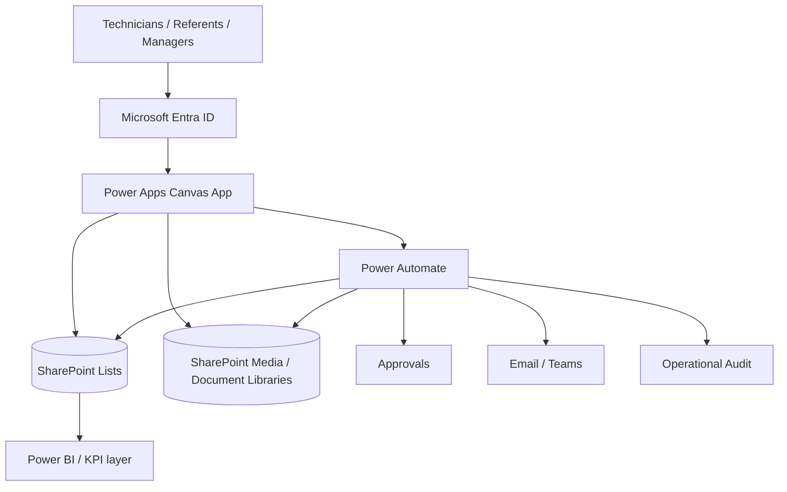
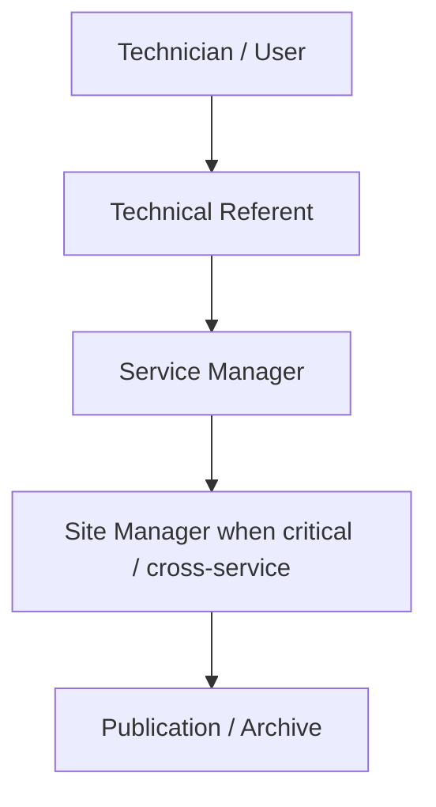
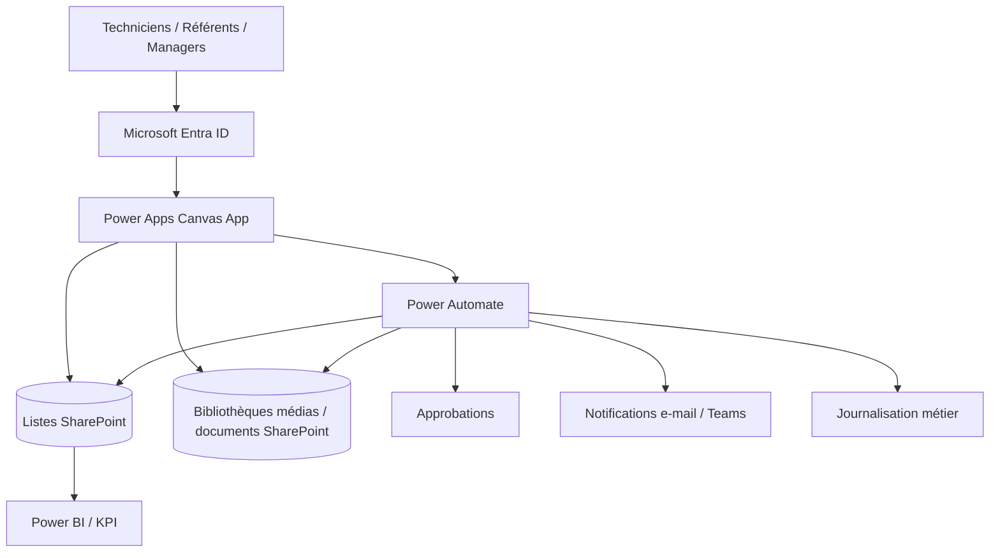
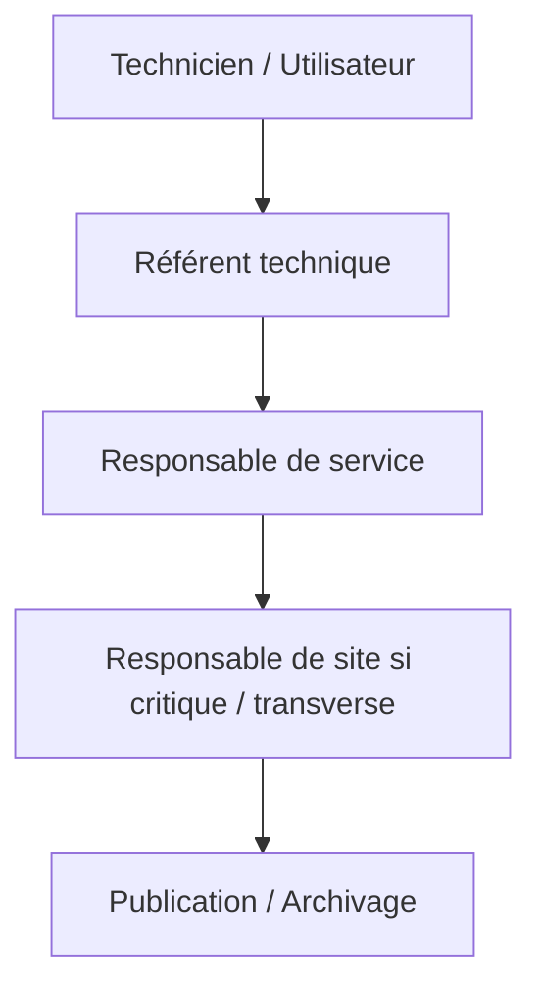

# Building Operations Hub — Power Platform Portfolio

[English](#english) · [Français](#francais)

---

# 🇬🇧 English

> **Responsive industrial operations and on-call assistance application for multi-site, multi-building and multi-technical maintenance environments.**

## Professional context

This project is a **sanitised portfolio reconstruction inspired by digital maintenance, on-call support and operational knowledge-management work carried out in professional technical-maintenance environments**.

The public version preserves the business problem, navigation model, security principles, approval hierarchy and responsive UX while replacing production data and tenant-specific implementation details.

> This is **not an official employer/client deliverable**. The production `.msapp`, Power Fx formulas, flow exports, tenant identifiers, real contacts and confidential configuration are intentionally not published.

## Project demo

➡️ **[▶ Watch the Building Operations Hub demo on YouTube](https://www.youtube.com/watch?v=Y15BCn_i-fo)**

  

> **Video hosting:** the demo is hosted on YouTube so recruiters can watch it directly in the browser without downloading a file.

> **Main view:** one operational entry point for on-call assistance, hot barometry and the technical contact directory.

---

## Business objective

The objective is to reduce the time needed to find reliable operational information during maintenance and on-call interventions.

The application structures knowledge around the physical asset hierarchy:

**Site → Building → Floor/Zone → Equipment → Action/Tutorial**

It also centralises:

- Start / Stop / Configuration procedures;
- REX / troubleshooting content;
- complete tutorial libraries;
- technical-content proposals;
- governed contact management;
- intervention feedback / hot barometry.

---

## Application walkthrough

### 1. Operations hub

**What a recruiter should notice**

- Clear separation of the three main business services
- Fast operational entry point
- Consistent visual hierarchy
- Designed for technical users rather than back-office-only usage

---

### 2. Site selection

**What a recruiter should notice**

- Multi-site navigation
- Image-driven selection for fast field use
- Consistent card pattern
- Responsive layout able to adapt to smaller screens

---

### 3. Building selection

**What a recruiter should notice**

- Hierarchical navigation from site to building
- Building context retained in the journey
- Large click targets suitable for touch devices
- Operational information kept concise

---

### 4. Floor / technical-zone selection

**What a recruiter should notice**

- Physical asset hierarchy remains explicit
- Technical zones can coexist with normal floors
- Simple navigation model suitable for on-call technicians

---

### 5. Equipment library

**What a recruiter should notice**

- Equipment-specific navigation rather than generic documents
- Search/filter experience
- Technical metadata displayed before opening the asset
- Architecture ready to map equipment to SharePoint-governed records

---

### 6. Equipment action hub

**What a recruiter should notice**

- Contextual actions: **Start, Stop, Configuration and REX**
- One equipment becomes the context for all following content
- Direct access to the full tutorial library
- Separate content-proposal workflow

---

### 7. Start / commissioning tutorial

**What a recruiter should notice**

- One action = one dedicated technical tutorial
- Video/content metadata separated from the action category
- Individual tutorial can be governed, updated or archived independently
- User remains inside the equipment context

---

### 8. Configuration library

**What a recruiter should notice**

- Search and thematic filtering
- Multiple tutorials can exist for one equipment/action family
- Content cards support independent lifecycle management

---

### 9. REX / troubleshooting

**What a recruiter should notice**

- Operational feedback becomes reusable knowledge
- Troubleshooting content can be filtered by symptom/theme
- REX is treated as a governed knowledge base, not an informal note area

---

### 10. On-call contact directory

**What a recruiter should notice**

- Search by company, service, phone or e-mail
- Domain/service filtering
- Direct call/e-mail actions
- Production design separates public consultation from authorised edit/delete operations

---

### 11. Hot barometry — intervention reference

**What a recruiter should notice**

- Intervention reference validates the feedback context
- Simple field interaction for fast client feedback
- In production, the reference and submission are validated against the governed back end

---

### 12. Technical-content proposal

**What a recruiter should notice**

- Users can contribute knowledge without publishing directly
- Proposal remains pending until validation
- Title, context, video and procedure/REX description are captured separately
- Designed for Power Automate approval routing

---

### 13. Hot barometry — evaluation

**What a recruiter should notice**

- Simple 1–5 evaluation
- Clear visual hierarchy
- Immediate operational feedback
- Architecture ready for SharePoint storage and Power BI KPI analysis

---

## Main functional areas

| Area | Purpose |
|---|---|
| **On-call assistance** | Guide technicians from physical location to the right equipment procedure |
| **Equipment knowledge** | Start, Stop, Configuration, REX and additional tutorial types |
| **Technical-content governance** | Proposal, validation, publication and archive lifecycle |
| **Contact directory** | Find the right company/service contact quickly |
| **Contact governance** | Controlled creation, modification and deletion/archive requests |
| **Hot barometry** | Capture intervention feedback linked to a reference |
| **Responsive UX** | Desktop, tablet, mobile portrait and mobile landscape |

---

## Enterprise architecture

### Target responsibilities

- **Power Apps** — presentation, responsive navigation, search, forms and operational interaction
- **SharePoint** — governed business data, contacts, equipment metadata, tutorial references and documents/media
- **Power Automate** — server-side validation, approvals, notifications, controlled mutations, archive/deletion logic
- **Entra ID / SharePoint groups** — role-based access and least privilege
- **Power BI** — optional downstream KPI/reporting layer for intervention feedback and operational performance

---

## Roles and approval hierarchy

A standard user can **propose** a tutorial or request a contact change without automatically receiving publication or deletion rights.

Sensitive operations are revalidated server-side. UI properties such as `Visible` or `DisplayMode` are treated as UX only, not as security controls.

For deletion, the preferred production pattern is:

**Request → Server-side scope check → Approval → Archive / soft delete → Audit → Notification**

---

## Key capabilities demonstrated

| Area | Demonstrated capability |
|---|---|
| **Power Apps UX** | Multi-screen responsive Canvas App for technical field use |
| **Responsive design** | Desktop, tablet, portrait and landscape layouts |
| **Navigation architecture** | Site → Building → Floor/Zone → Equipment → Action |
| **Knowledge management** | Equipment tutorials, REX, search and categories |
| **SharePoint design** | Governed entity/data model and media/document separation |
| **Power Automate** | Approval routing, validation, notifications and controlled mutations |
| **Security** | Least privilege, role hierarchy and server-side validation |
| **Reliability** | Error-aware writes, idempotency/duplicate considerations and auditability |
| **Accessibility** | Accessible labels, logical focus and responsive reading order |
| **ALM** | DEV → TEST/UAT → PROD with Solutions, Connection References and Environment Variables |
| **Portfolio privacy** | Sanitised data and no public production source package |

## Tech stack

**Power Apps · Power Fx · Power Automate · SharePoint · Microsoft Entra ID · Microsoft 365 · Power BI integration pattern**

## Technical documentation

- [Architecture](./docs/ARCHITECTURE.md)
- [Security & approvals](./docs/SECURITY_AND_APPROVALS.md)
- [User journey](./docs/USER_JOURNEY.md)
- [Demo](./demo/)

## Data privacy & source-code policy

The repository is a public portfolio version.

- Screenshots use synthetic/sanitised data.
- Real tenant URLs and production connections are excluded.
- Production identities and confidential business data are excluded.
- The `.msapp`, Power Fx implementation and Power Automate exports are not distributed.

A deeper technical walkthrough can be provided during an interview or freelance discussion without distributing the source package.

---

# 🇫🇷 Français

> **Application responsive d'exploitation industrielle et d'aide à l'astreinte pour des environnements de maintenance multi-sites, multi-bâtiments et multi-techniques.**

## Contexte professionnel

Ce projet est une **reconstruction portfolio anonymisée inspirée de travaux de digitalisation de la maintenance, d'aide à l'astreinte et de gestion des connaissances opérationnelles réalisés dans des environnements professionnels de maintenance technique**.

La version publique conserve le besoin métier, le modèle de navigation, les principes de sécurité, la hiérarchie d'approbation et l'UX responsive, tout en remplaçant les données de production et les détails propres au tenant.

> Il ne s'agit **pas d'un livrable officiel d'un employeur ou client**. Le `.msapp` de production, les formules Power Fx, exports de flows, identifiants du tenant, contacts réels et configurations confidentielles ne sont volontairement pas publiés.

## Démonstration

➡️ **[▶ Voir la démonstration Building Operations Hub sur YouTube](https://www.youtube.com/watch?v=Y15BCn_i-fo)**

  

> **Hébergement vidéo :** la démonstration est hébergée sur YouTube afin qu'un recruteur puisse la lire directement dans son navigateur sans télécharger de fichier.

> **Vue principale :** un point d'entrée unique vers l'aide à l'astreinte, la barométrie à chaud et l'annuaire technique.

---

## Objectif métier

L'objectif est de réduire le temps nécessaire pour retrouver une information opérationnelle fiable pendant une intervention de maintenance ou d'astreinte.

L'application structure la connaissance selon la hiérarchie physique :

**Site → Bâtiment → Étage/Zone → Équipement → Action/Tutoriel**

Elle centralise également :

- procédures Marche / Arrêt / Paramétrage ;
- REX / dépannage ;
- bibliothèque complète de tutoriels ;
- propositions de nouveaux contenus ;
- annuaire gouverné ;
- barométrie à chaud.

---

## Présentation des vues

### 1. Hub opérationnel

**Ce qu'un recruteur peut identifier immédiatement**

- séparation claire des trois services métier ;
- point d'entrée opérationnel rapide ;
- hiérarchie visuelle cohérente ;
- interface pensée pour des utilisateurs techniques.

### 2. Choix du site

**Ce qu'un recruteur peut identifier immédiatement**

- navigation multi-sites ;
- sélection visuelle adaptée au terrain ;
- modèle de cartes cohérent ;
- conception responsive.

### 3. Choix du bâtiment

**Ce qu'un recruteur peut identifier immédiatement**

- navigation hiérarchique ;
- contexte du site conservé ;
- grandes zones cliquables adaptées au tactile.

### 4. Choix de l'étage / zone technique

**Ce qu'un recruteur peut identifier immédiatement**

- hiérarchie physique explicite ;
- prise en charge des zones techniques et des étages classiques ;
- parcours simple pour l'astreinte.

### 5. Bibliothèque des équipements

**Ce qu'un recruteur peut identifier immédiatement**

- navigation orientée équipement plutôt que document générique ;
- recherche et filtrage ;
- métadonnées techniques visibles avant ouverture ;
- architecture compatible avec un référentiel SharePoint gouverné.

### 6. Hub d'actions équipement

**Ce qu'un recruteur peut identifier immédiatement**

- actions contextuelles : **Marche, Arrêt, Paramétrage et REX** ;
- contexte équipement conservé ;
- accès à tous les tutoriels ;
- proposition de contenu séparée.

### 7. Tutoriel Marche / mise en service

**Ce qu'un recruteur peut identifier immédiatement**

- une action correspond à un contenu technique dédié ;
- chaque tutoriel possède son propre cycle de vie ;
- navigation maintenue dans le contexte de l'équipement.

### 8. Bibliothèque Paramétrage

**Ce qu'un recruteur peut identifier immédiatement**

- recherche et filtres thématiques ;
- plusieurs tutoriels possibles pour un équipement ;
- gestion indépendante de chaque contenu.

### 9. REX / Dépannage

**Ce qu'un recruteur peut identifier immédiatement**

- transformation du retour terrain en connaissance réutilisable ;
- filtrage par symptôme/thème ;
- REX traité comme une base de connaissance gouvernée.

### 10. Annuaire d'astreinte

**Ce qu'un recruteur peut identifier immédiatement**

- recherche entreprise/service/téléphone/e-mail ;
- filtres par domaine ;
- actions Appeler / E-mail ;
- séparation entre consultation publique et gestion autorisée.

### 11. Barométrie — référence intervention

**Ce qu'un recruteur peut identifier immédiatement**

- contexte de l'intervention validé par une référence ;
- interaction très simple ;
- validation/stockage côté source prévus dans l'architecture entreprise.

### 12. Proposition de contenu technique

**Ce qu'un recruteur peut identifier immédiatement**

- contribution utilisateur sans publication directe ;
- statut en attente avant validation ;
- titre, contexte, vidéo et description structurés ;
- scénario conçu pour une approbation Power Automate.

### 13. Barométrie — évaluation

**Ce qu'un recruteur peut identifier immédiatement**

- évaluation 1 à 5 rapide ;
- lecture visuelle immédiate ;
- données exploitables ensuite dans SharePoint / Power BI.

---

## Principaux domaines fonctionnels

| Domaine | Objectif |
|---|---|
| **Aide à l'astreinte** | Guider le technicien jusqu'à la bonne procédure équipement |
| **Connaissance équipement** | Marche, Arrêt, Paramétrage, REX et autres types de tutoriels |
| **Gouvernance du contenu** | Proposition, validation, publication et archivage |
| **Annuaire** | Trouver rapidement le bon contact entreprise/service |
| **Gouvernance des contacts** | Création, modification et demande de suppression/archivage |
| **Barométrie** | Retour client/intervention associé à une référence |
| **UX responsive** | Desktop, tablette, mobile portrait et paysage |

---

## Architecture entreprise

### Responsabilités cibles

- **Power Apps** — interface, navigation responsive, recherche, formulaires et interaction terrain ;
- **SharePoint** — données gouvernées, contacts, équipements, métadonnées tutoriels et documents/médias ;
- **Power Automate** — validation serveur, approbations, notifications, mutations contrôlées et archivage ;
- **Entra ID / groupes SharePoint** — accès par rôle et moindre privilège ;
- **Power BI** — couche optionnelle de KPI/reporting pour le feedback et la performance opérationnelle.

---

## Hiérarchie des rôles et approbations

Un utilisateur standard peut **proposer** un tutoriel ou demander une modification de contact sans obtenir automatiquement les droits de publication ou suppression.

Les actions sensibles sont revalidées côté serveur. Les propriétés `Visible` ou `DisplayMode` restent de l'UX et ne constituent pas une barrière de sécurité.

Pour la suppression, le modèle cible est :

**Demande → Validation du périmètre côté serveur → Approbation → Archivage/désactivation → Journalisation → Notification**

---

## Compétences démontrées

| Domaine | Compétence démontrée |
|---|---|
| **Power Apps** | Application Canvas multi-écrans pour usage terrain |
| **Responsive** | Desktop, tablette, portrait et paysage |
| **Architecture navigation** | Site → Bâtiment → Étage/Zone → Équipement → Action |
| **Knowledge management** | Tutoriels, REX, recherche et catégories |
| **SharePoint** | Modèle de données gouverné et séparation données/médias |
| **Power Automate** | Approbations, validation, notifications et mutations contrôlées |
| **Sécurité** | Moindre privilège, rôles et validation serveur |
| **Fiabilité** | Gestion des erreurs, anti-doublon/idempotence et traçabilité |
| **Accessibilité** | Labels accessibles, focus logique et responsive |
| **ALM** | DEV → TEST/UAT → PROD, Solutions, Connection References, Environment Variables |
| **Confidentialité** | Données anonymisées et absence de package source public |

## Stack technique

**Power Apps · Power Fx · Power Automate · SharePoint · Microsoft Entra ID · Microsoft 365 · Pattern d'intégration Power BI**

## Documentation technique

- [Architecture](./docs/ARCHITECTURE_FR.md)
- [Sécurité & approbations](./docs/SECURITY_AND_APPROVALS_FR.md)
- [Parcours utilisateur](./docs/USER_JOURNEY_FR.md)
- [Démonstration](./demo/)

## Confidentialité & code source

Cette version est destinée au portfolio public.

- données synthétiques/anonymisées ;
- pas d'URL de tenant ou connexion production ;
- pas d'identité réelle/confidentielle ;
- pas de `.msapp` ;
- pas de formules Power Fx d'implémentation ;
- pas d'exports Power Automate.

Une présentation technique plus détaillée peut être réalisée en entretien ou dans le cadre d'une discussion freelance sans distribuer le package source.
