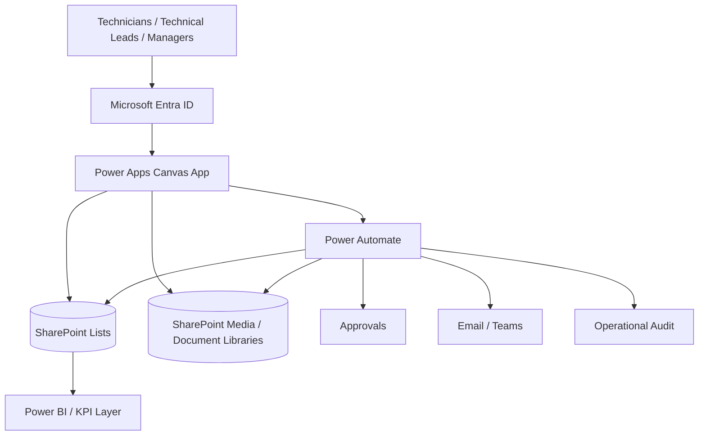

# Building Operations Hub

> **Power Apps · Power Automate · SharePoint · Responsive field UX**

[← Main portfolio](../../README.md) · [▶ Watch demo](https://www.youtube.com/watch?v=Y15BCn_i-fo) · [📊 Power BI portfolio](https://github.com/jeffersonkuku/powerbi-portfolio-projects) · [🇫🇷 Français](#francais)

## 30-second overview

**Business problem:** maintenance and on-call teams need fast access to reliable procedures, equipment knowledge, contacts and intervention feedback without searching across multiple tools.

**Solution:** one responsive Power Apps experience organised around the physical asset journey:

**Site → Building → Floor / Zone → Equipment → Action / Tutorial**

**What the solution covers:** equipment procedures, troubleshooting knowledge, technical contacts, content proposals, controlled approval paths and post-intervention feedback.

**Stack:** Power Apps Canvas · Power Fx · SharePoint · Power Automate · Microsoft 365

### ▶ See it working

**[Watch the full Building Operations Hub demo on YouTube →](https://www.youtube.com/watch?v=Y15BCn_i-fo)**

---

## Product journey

### 1. Operations hub

One entry point gives field users direct access to on-call assistance, post-intervention feedback and the technical contact directory.

### 2. Site selection

The user selects the intervention site through a visual, touch-friendly interface before moving deeper into the physical asset hierarchy.

### 3. Building selection

The selected site remains the working context while the user moves to the relevant building.

### 4. Floor / technical zone

Buildings are broken down into floors or technical zones so the path mirrors the real operating environment.

### 5. Equipment library

Search and filters help the user reach the right equipment while keeping technical metadata visible before opening it.

### 6. Equipment action hub

Each equipment record becomes the context for **Start, Stop, Configuration, troubleshooting / lessons learned and additional tutorials**.

### 7. Start / commissioning tutorial

The user opens a dedicated procedure for the selected action instead of navigating through generic documents.

### 8. Configuration library

Several configuration tutorials can coexist for one asset and be searched or filtered independently.

### 9. Troubleshooting & lessons learned

Field feedback is structured as reusable operational knowledge rather than remaining in informal notes or conversations.

### 10. Technical contact directory

Users can quickly find the right company, service, phone number or e-mail from a governed directory.

### 11. Intervention reference

The feedback journey starts from an intervention reference so the response can be associated with the right operational context.

### 12. Technical-content proposal

Users can propose new technical knowledge without publishing it directly; the contribution is designed to enter a controlled validation workflow.

### 13. Post-intervention feedback

A simple rating captures immediate service feedback that can then feed operational reporting.

---

## What this case study demonstrates

| Area | Evidence in the case study |
|---|---|
| **Power Apps** | Multi-screen Canvas application for field and operational users |
| **Responsive UX** | Desktop, tablet, mobile portrait and landscape design approach |
| **Navigation** | Physical hierarchy from site to equipment and action |
| **Knowledge management** | Procedures, tutorials, troubleshooting and reusable feedback |
| **SharePoint** | Structured business data plus document/media separation |
| **Power Automate** | Approval, validation, notification and controlled-action patterns |
| **Security design** | Least privilege and server-side validation principles |
| **Reliability design** | Explicit error paths, auditability and duplicate/idempotency considerations |
| **ALM design** | DEV → TEST/UAT → PROD, Solutions, Connection References and Environment Variables |

## Architecture

### Responsibilities

- **Power Apps** — responsive navigation, search, forms and field interaction.
- **SharePoint** — governed records, contacts, equipment metadata and document/media references.
- **Power Automate** — approval routing, sensitive server-side validation, notifications and controlled mutations.
- **Microsoft Entra ID / SharePoint groups** — role-based access and least-privilege model.
- **Power BI** — downstream analysis for feedback and operational performance.

## Security and governance model

The production-oriented design treats Power Apps properties such as `Visible` and `DisplayMode` as UX controls only, not as the security boundary.

Sensitive actions are designed to be revalidated at the source or flow layer. For destructive actions, the preferred pattern is:

**Request → scope validation → approval → archive / soft delete → audit → notification**

The public repository documents the pattern without publishing production credentials, tenant URLs, connection details or confidential source packages.

## Engineering documentation

- [Architecture](./docs/ARCHITECTURE.md)
- [Security & approvals](./docs/SECURITY_AND_APPROVALS.md)
- [User journey](./docs/USER_JOURNEY.md)
- [Demo notes](./demo/README.md)

## Public portfolio boundary

This is a sanitised public case study based on professional maintenance and operational-support workflows.

Production `.msapp` packages, tenant-specific Power Fx implementation, flow exports, credentials, real contacts and confidential production datasets are intentionally not published.

---

# 🇫🇷 Français

## Vue en 30 secondes

**Problème métier :** les équipes de maintenance et d'astreinte doivent retrouver rapidement les procédures, informations équipements, contacts et retours d'intervention.

**Solution :** une application Power Apps responsive organisée autour du parcours terrain :

**Site → Bâtiment → Étage / Zone → Équipement → Action / Tutoriel**

**Technologies :** Power Apps · Power Fx · SharePoint · Power Automate · Microsoft 365

**[▶ Voir la démonstration complète sur YouTube](https://www.youtube.com/watch?v=Y15BCn_i-fo)**

## Fonctionnalités principales

- aide à l'astreinte et navigation multi-sites ;
- procédures Marche / Arrêt / Paramétrage ;
- dépannage et capitalisation des retours terrain ;
- annuaire technique ;
- proposition de nouveaux contenus ;
- validation et gouvernance des contributions ;
- retour après intervention ;
- conception responsive multi-support.

## Ce que le projet démontre

**Power Apps Canvas · Power Fx · Power Automate · SharePoint · Responsive Design · Navigation hiérarchique · Gestion de connaissances · Sécurité par rôles · Validation côté serveur · Gestion des erreurs · ALM**

## Architecture cible

La logique de production repose sur une séparation claire des responsabilités :

**Power Apps pour l'UX → SharePoint pour les données/documents → Power Automate pour les traitements contrôlés → Entra ID / groupes SharePoint pour les accès → Power BI pour le reporting.**

Les contrôles d'interface ne sont pas considérés comme une sécurité. Les opérations sensibles sont conçues pour être validées côté source ou côté flow.

## Documentation

- [Architecture FR](./docs/ARCHITECTURE_FR.md)
- [Sécurité & approbations FR](./docs/SECURITY_AND_APPROVALS_FR.md)
- [Parcours utilisateur FR](./docs/USER_JOURNEY_FR.md)

La version publique est anonymisée et n'expose ni package de production, ni identifiants de tenant, ni données confidentielles.
