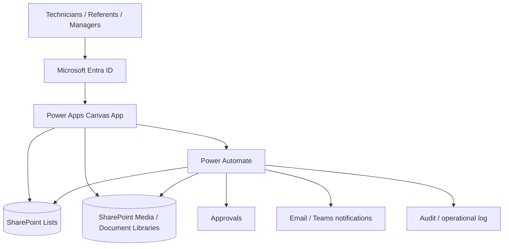

# Building Operations Hub — Power Platform Case Study

[**English**](README.md) · [**Français**](README_FR.md)


A **sanitised portfolio case study** for a responsive industrial operations and on-call assistance application designed for a **multi-site, multi-building and multi-technical maintenance environment**.

> **Source code is intentionally private.** The `.msapp`, Power Fx implementation, Power Automate exports, tenant configuration and production data are not distributed.

---

## Demo

[](demo/Building_Operations_Hub_Demo.mp4)

**[▶ Watch the full demo video](demo/Building_Operations_Hub_Demo.mp4)**

The public portfolio recording is cropped to focus on the application and hides personal contact details visible during the original recording.

---

## Business problem

On a multi-technical industrial site, operational information is often fragmented across documents, shared folders, e-mails, phone lists and individual knowledge.

The application provides one operational path:

**Site → Building → Floor/Zone → Equipment → Action/Tutorial**

and centralises:

- on-call assistance;
- equipment procedures;
- Start / Stop / Configuration / REX;
- technical-content proposals;
- governed contact directory;
- hot barometry / intervention feedback.

---

## Product walkthrough

| Area | Preview |
|---|---|
| Home |  |
| Site selection |  |
| Building selection |  |
| Equipment library |  |
| Equipment action hub |  |
| Contact directory |  |
| Hot barometry |  |

**[Open the complete screenshot gallery →](assets/)**

The uploaded PNG files are stored at their original uploaded quality; they are not resized or recompressed before commit.

---

## Enterprise architecture



### Power Apps
Responsive operational interface for navigation, search, tutorials, contacts, feedback and controlled submissions.

### SharePoint
Governed source for sites, buildings, zones, equipment, contacts, tutorial metadata, media references, proposals and audit-oriented business data.

### Power Automate
Server-side validation, approval routing, notifications, controlled mutations, duplicate-prevention logic, archive/deletion workflow and traceability.

### Entra ID / SharePoint groups
Role-based access and least privilege. UI properties such as `Visible` are treated as UX only, never as the security boundary.

---

## Roles and approvals

```text
Technician / User
        ↓ proposal
Technical Referent
        ↓ technical validation
Service Manager
        ↓ business approval
Site Manager
        ↓ only when critical / cross-service
Publication / Archive
```

A standard user can propose content or request a contact change without automatically receiving publication or deletion rights.

For deletion, the preferred production pattern is **request → validation → approval → archive/soft delete → audit**, rather than an uncontrolled client-side hard delete.

---

## Responsive & accessibility scope

Designed and tested conceptually for:

- desktop;
- tablet;
- mobile portrait;
- mobile landscape.

The implementation uses responsive formulas, logical focus/navigation, accessible labels and parent-bound layouts. Accessibility and App Checker results must be revalidated in the target environment before production release.

---

## ALM target

```text
DEV → TEST / UAT → PROD
```

Production deployment is designed around Solutions, Connection References, Environment Variables, controlled connections, App/Solution Checker, Monitor and regression testing.

---

## Technical documentation

- **[Architecture](docs/ARCHITECTURE.md)**
- **[Security & approvals](docs/SECURITY_AND_APPROVALS.md)**
- **[User journey](docs/USER_JOURNEY.md)**
- **[Architecture — Français](docs/ARCHITECTURE_FR.md)**
- **[Sécurité & approbations — Français](docs/SECURITY_AND_APPROVALS_FR.md)**

---

## Public repository boundary

### Published
- screenshots;
- demo video;
- architecture;
- user journey;
- role/approval model;
- security principles;
- responsive/ALM approach.

### Not published
- `.msapp`;
- Power Fx formulas;
- Power Automate exports;
- production SharePoint URLs;
- Connection References;
- secrets/credentials;
- production identities and datasets.

A technical walkthrough can be provided during an interview or freelance discussion without distributing the source package.
