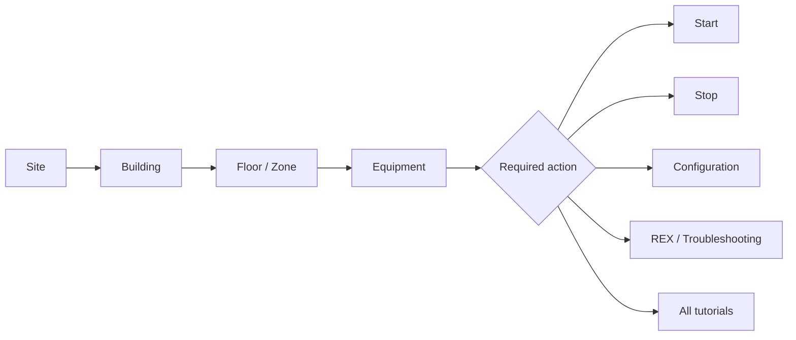
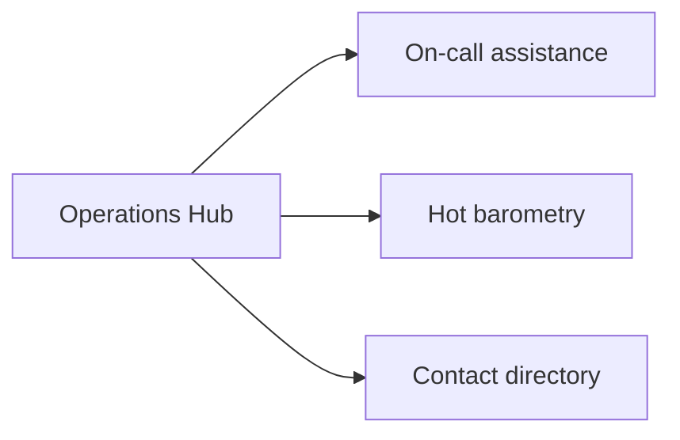
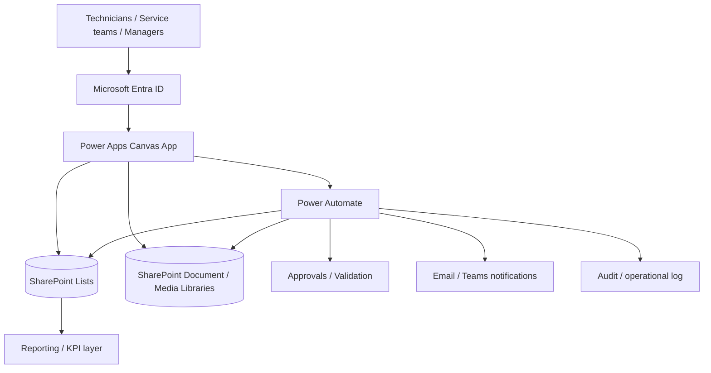
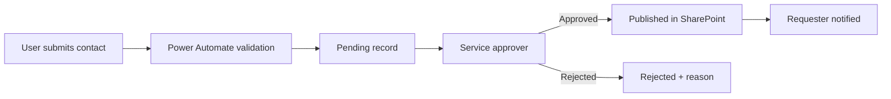
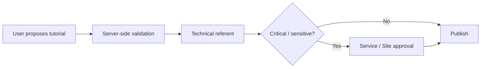

# Building Operations Hub — Power Platform Case Study


A **sanitised portfolio case study** for a responsive industrial operations and on-call assistance application designed for a **multi-site, multi-building and multi-technical maintenance environment**.

The solution helps technicians and operations teams move quickly from **Site → Building → Floor/Zone → Equipment → Action/Tutorial**, while also providing an on-call contact directory, satisfaction/barometry workflow, technical content proposals and governed content management.

> **Source-code boundary:** the Power Apps `.msapp`, Power Fx formulas, Power Automate exports, tenant URLs, connection references, production identities and confidential implementation details are intentionally **not published**. This repository demonstrates the product, architecture, UX, governance model and engineering approach only.

> **Portfolio data:** all screenshots use **synthetic or sanitised demo data**. The enterprise implementation pattern described below uses SharePoint and Power Automate as governed back-end services.

---

## Demo video

### ▶ Full walkthrough — coming soon

The dedicated location is ready here:

**[`demo/README.md`](demo/README.md)**

Recommended final file name:

`demo/building-operations-hub-demo.mp4`

For a large high-quality recording, the repository can also link to an unlisted hosted video while keeping a thumbnail and walkthrough description in `demo/`.

---

## Product walkthrough

### 1. Operations hub


Three main operational services are available from a single entry point:

- **On-call assistance** — equipment procedures and troubleshooting;
- **Barometry** — immediate intervention feedback;
- **Contacts** — fast access to the right company/service contact.

### 2. Site selection


### 3. Building selection


### 4. Floor / technical zone selection


### 5. Equipment library


### 6. Equipment action hub


The equipment workspace exposes contextual actions such as:

- Start / commissioning;
- Stop;
- Configuration;
- REX / troubleshooting;
- complete tutorial library;
- proposal of new technical content.

### 7. Start / commissioning tutorial


### 8. Configuration library


### 9. REX / troubleshooting


### 10. On-call contact directory


### 11. Hot barometry — intervention reference


### 12. Technical content proposal


### 13. Hot barometry — intervention rating


> The original PNG files in `assets/` are committed **without resizing or recompression**. GitHub may visually scale them in the README, but the source image files remain unchanged.

---

## Business context

A multi-technical industrial site can involve several buildings, zones and service families operating at the same time:

- HVAC / CVC;
- electricity;
- BMS / GTB-GTC;
- plumbing;
- fire safety / SSI;
- lifts;
- general maintenance;
- specialist contractors;
- on-call teams.

Operational information is often fragmented between documents, email, shared folders, phone lists and individual knowledge. During an on-call intervention, the technician needs the **correct information for the correct asset, quickly and safely**.

Building Operations Hub centralises that operational journey while keeping content ownership and approvals under control.

---

## End-to-end user journey



The same application also gives access to:



---

## Enterprise target architecture

The public demonstration is self-contained and synthetic. In an enterprise deployment, the application is designed around the following separation of responsibilities:



### Power Apps — presentation and operational UX

Power Apps provides the responsive user interface for:

- navigation through sites, buildings, zones and equipment;
- equipment-specific tutorial discovery;
- contextual search and filtering;
- contact lookup;
- satisfaction/barometry capture;
- submission of new contacts or tutorials;
- controlled edit interfaces for authorised users.

Power Apps is **not treated as the security boundary**. Hiding a button with `Visible` or changing `DisplayMode` improves UX but does not grant or revoke back-end permissions.

### SharePoint — governed data and media layer

A production-oriented SharePoint design can separate the main entities into lists/libraries such as:

| Data domain | Example SharePoint object |
|---|---|
| Sites | `Sites` |
| Buildings | `Buildings` |
| Floors / zones | `Zones` |
| Equipment | `Equipment` |
| Tutorial metadata | `Tutorials` |
| Tutorial types | `TutorialTypes` |
| Contacts | `Contacts` |
| Contact categories | `ContactTypes` |
| Content proposals | `ContentProposals` |
| Change / deletion requests | `ChangeRequests` |
| Barometry / satisfaction | `InterventionFeedback` |
| Audit trail | `OperationalAudit` |
| Photos / videos / documents | SharePoint media/document library |

Video URLs, tutorial references, contact numbers, e-mail addresses and controlled operational metadata are therefore **centrally maintained**, rather than hard-coded into the Canvas App.

### Power Automate — server-side workflow and governance

Power Automate is used for actions that should not rely only on the client application:

- validate submitted parameters server-side;
- create/update governed records;
- prevent obvious duplicates;
- route approval requests by site/service/type;
- manage content publication status;
- archive approved deletions;
- notify requesters and approvers;
- record audit information;
- support reminders/escalations where required.

See **[Architecture](docs/ARCHITECTURE.md)** and **[Security & approvals](docs/SECURITY_AND_APPROVALS.md)**.

---

## Roles and approval model

A professional implementation uses role-based access and least privilege.

| Role | Typical responsibility |
|---|---|
| Technician / User | Read operational content, search contacts, submit proposals |
| Technical Referent | Technical validation for a service/equipment family |
| Service Manager | Approval of content and contacts for the service |
| Site Manager | Cross-service/site governance and critical approvals |
| Functional Administrator | Configuration, role mapping, controlled administration |

A user can **request** a new contact/tutorial without automatically publishing it.

Example contact workflow:



Example tutorial workflow:



---

## Deletion and archive strategy

The user interface can expose a delete action only in an authorised edit/admin context, but the **real control is enforced on the back end**.

A professional pattern is:

1. authorised user submits a deletion request;
2. Power Automate validates identity, role and scope;
3. the appropriate owner approves/rejects;
4. the record is preferably **soft-deleted / archived** first;
5. the action is logged;
6. the requester is notified.

This preserves traceability and avoids treating the Canvas App's visual state as security.

---

## Security model

The target architecture combines:

- Microsoft Entra ID authentication;
- SharePoint groups / Entra security groups;
- least-privilege permissions;
- service/site-based responsibility;
- DLP policies at Power Platform environment level;
- server-side validation for sensitive Flow inputs;
- no hard-coded credentials/secrets;
- controlled ownership of connections and flows.

Example role groups:

```text
IND-App-Users
IND-CVC-Referents
IND-Electrical-Referents
IND-Service-Managers
IND-Site-Managers
IND-App-Functional-Admins
```

Detailed model: **[docs/SECURITY_AND_APPROVALS.md](docs/SECURITY_AND_APPROVALS.md)**.

---

## Responsive and accessible UX

The application was designed for:

- desktop;
- tablet;
- mobile portrait;
- mobile landscape.

The UI adapts navigation, card sizing, forms, modal layouts and text density according to available space.

Engineering checks include:

- controls remain inside their parent containers;
- keyboard navigation for interactive controls;
- accessible labels;
- logical focus flow;
- responsive layouts rather than relying on fixed canvas scaling;
- visible state not used as a security mechanism.

---

## ALM and production lifecycle

Target lifecycle:

```text
DEV  →  TEST / UAT  →  PROD
```

Production-oriented deployment uses:

- Power Platform Solutions;
- Connection References;
- Environment Variables;
- source/version control for maintainable artefacts;
- controlled deployment;
- rollback planning;
- App Checker / Solution Checker;
- Monitor and regression testing.

---

## Repository boundary

### Published

- product screenshots;
- business use case;
- architecture;
- role and approval model;
- security principles;
- user journey;
- demo-video placeholder;
- engineering/ALM approach.

### Not published

- `.msapp` package;
- Power Fx formulas;
- Power Automate flow exports;
- SharePoint tenant/site URLs;
- connection references;
- environment secrets;
- production identities;
- confidential customer information;
- production datasets.

A technical walkthrough can be provided during an interview or freelance discussion without distributing the source code.

---

## Repository structure

```text
projects/building-operations-hub/
├── README.md
├── assets/
│   ├── 01-home.png
│   ├── 02-sites.png
│   ├── 03-buildings.png
│   ├── 04-floors.png
│   ├── 05-equipment-library.png
│   ├── 06-equipment-detail.png
│   ├── 07-start-tutorial.png
│   ├── 08-configuration.png
│   ├── 09-troubleshooting.png
│   ├── 10-contacts.png
│   ├── 11-barometry-reference.png
│   ├── 12-content-proposal.png
│   ├── 13-barometry-rating.png
│   └── README.md
├── demo/
│   └── README.md
└── docs/
    ├── ARCHITECTURE.md
    ├── SECURITY_AND_APPROVALS.md
    └── USER_JOURNEY.md
```

---

## Résumé FR

**Building Operations Hub** est une vitrine anonymisée d'une application Power Platform destinée à l'exploitation et à l'astreinte d'un environnement industriel multi-technique.

Le parcours principal est **Site → Bâtiment → Étage/Zone → Équipement → Action/Tutoriel**. L'application couvre également l'annuaire d'astreinte, la barométrie à chaud et la proposition de nouveaux contenus techniques.

Dans l'architecture entreprise présentée, SharePoint centralise les données et médias, Power Automate gère les validations, approbations, notifications et mutations sensibles, et les droits reposent sur Entra ID / SharePoint avec une logique de moindre privilège.

**Aucun code source de l'application n'est publié dans ce dépôt.**
