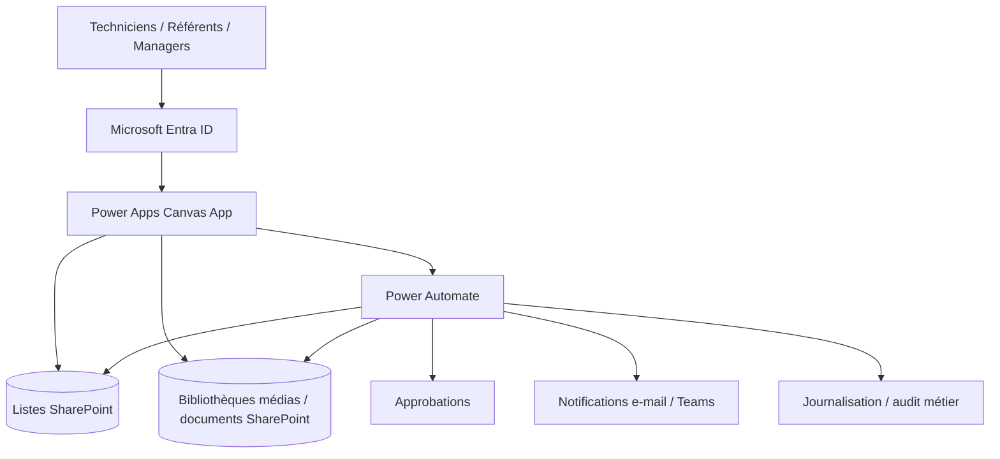

# Building Operations Hub — Étude de cas Power Platform

[**English**](README.md) · [**Français**](README_FR.md)


Étude de cas **anonymisée** d'une application responsive d'exploitation et d'astreinte pour un environnement industriel **multi-site, multi-bâtiment et multi-technique**.

> **Le code source reste volontairement privé.** Le `.msapp`, les formules Power Fx, les exports Power Automate, la configuration du tenant et les données de production ne sont pas distribués.

---

## Démonstration

[](demo/Building_Operations_Hub_Demo.mp4)

**[▶ Voir la vidéo complète](demo/Building_Operations_Hub_Demo.mp4)**

La vidéo publique a été préparée pour le portfolio : les coordonnées personnelles visibles pendant la démonstration sont masquées et l'image est recentrée sur l'application.

---

## Problème métier

Sur un site industriel multi-technique, l'information opérationnelle peut être dispersée entre documents, dossiers partagés, e-mails, listes de téléphone et connaissances individuelles.

L'application propose un parcours unique :

**Site → Bâtiment → Étage/Zone → Équipement → Action/Tutoriel**

et centralise :

- l'aide à l'astreinte ;
- les procédures équipements ;
- Marche / Arrêt / Paramétrage / REX ;
- les propositions de nouveaux contenus techniques ;
- l'annuaire d'astreinte gouverné ;
- la barométrie à chaud / retour d'intervention.

---

## Aperçu du produit

| Module | Aperçu |
|---|---|
| Accueil |  |
| Choix du site |  |
| Choix du bâtiment |  |
| Bibliothèque équipements |  |
| Détail équipement |  |
| Annuaire d'astreinte |  |
| Barométrie à chaud |  |

**[Voir toutes les captures →](assets/)**

Les PNG sont stockés dans la qualité d'origine fournie, sans redimensionnement ni recompression avant commit.

---

## Architecture entreprise cible



### Power Apps
Interface opérationnelle responsive pour la navigation, la recherche, les tutoriels, les contacts, le feedback et les soumissions contrôlées.

### SharePoint
Source gouvernée pour les sites, bâtiments, zones, équipements, contacts, métadonnées de tutoriels, références médias, propositions et données de traçabilité.

### Power Automate
Validation côté serveur, routage des approbations, notifications, mutations contrôlées, logique anti-doublon, archivage/suppression et journalisation.

### Entra ID / groupes SharePoint
Accès par rôle et moindre privilège. Les propriétés UI comme `Visible` restent uniquement de l'UX et ne sont jamais considérées comme une barrière de sécurité.

---

## Rôles et approbations

```text
Technicien / Utilisateur
        ↓ proposition
Référent technique
        ↓ validation technique
Responsable de service
        ↓ approbation métier
Responsable de site
        ↓ uniquement si critique / transverse
Publication / Archivage
```

Un utilisateur standard peut proposer un contenu ou demander la modification d'un contact sans obtenir automatiquement le droit de publier ou de supprimer.

Pour la suppression, le modèle cible privilégie **demande → validation → approbation → archivage/désactivation → journalisation**, plutôt qu'une suppression physique directe déclenchée depuis Canvas.

---

## Responsive & accessibilité

Conception prévue pour :

- desktop ;
- tablette ;
- mobile portrait ;
- mobile paysage.

L'implémentation s'appuie sur des formules responsives, un ordre de focus logique, des libellés accessibles et des contrôles restant dans leurs parents. Les résultats d'accessibilité et de l'App Checker doivent être revalidés dans l'environnement cible avant une mise en production.

---

## ALM cible

```text
DEV → TEST / UAT → PROD
```

Le déploiement production est conçu autour des Solutions, Connection References, Environment Variables, connexions contrôlées, App/Solution Checker, Monitor et tests de non-régression.

---

## Documentation technique

- **[Architecture](docs/ARCHITECTURE_FR.md)**
- **[Sécurité & approbations](docs/SECURITY_AND_APPROVALS_FR.md)**
- **[Parcours utilisateur](docs/USER_JOURNEY_FR.md)**
- **[Architecture — English](docs/ARCHITECTURE.md)**
- **[Security & approvals — English](docs/SECURITY_AND_APPROVALS.md)**

---

## Limite du dépôt public

### Publié
- captures ;
- vidéo de démonstration ;
- architecture ;
- parcours utilisateur ;
- modèle de rôles/approbations ;
- principes de sécurité ;
- approche responsive/ALM.

### Non publié
- `.msapp` ;
- formules Power Fx ;
- exports Power Automate ;
- URLs SharePoint de production ;
- Connection References ;
- secrets/identifiants ;
- identités et données de production.

Une présentation technique détaillée peut être faite en entretien ou lors d'une discussion freelance sans distribuer le package source.
