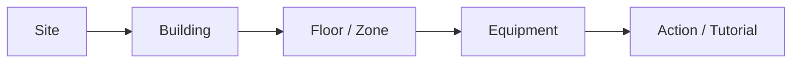
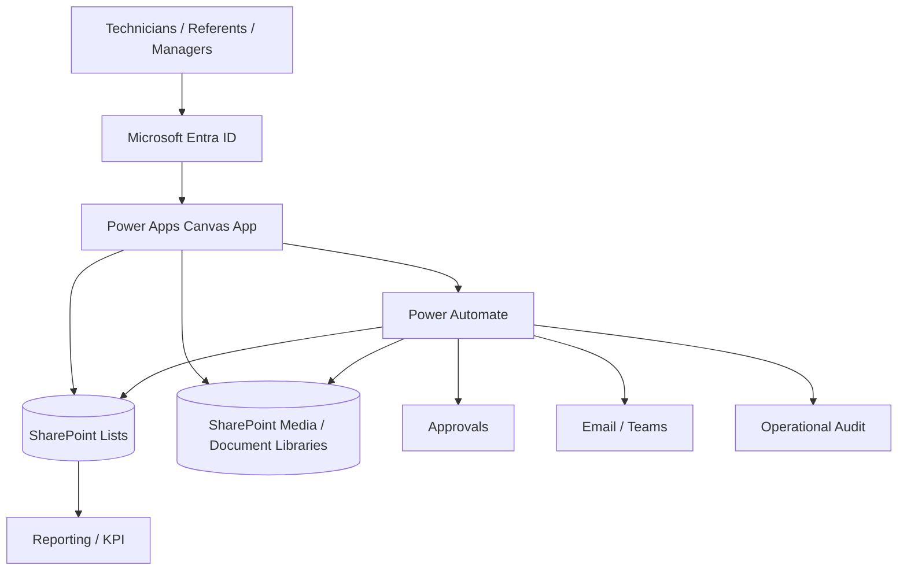
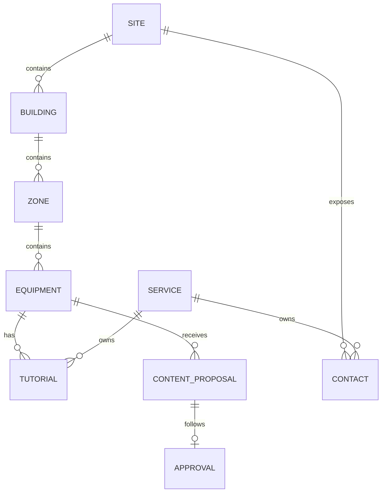
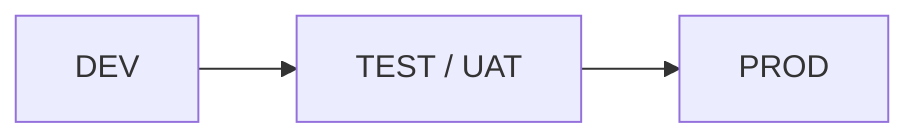

# Enterprise Architecture — Building Operations Hub

This document describes the **target enterprise implementation pattern** behind the public portfolio demonstration.

The screenshots use synthetic/sanitised data. The production-oriented architecture separates the user interface, governed data, workflow orchestration, permissions and deployment lifecycle.

---

## 1. Industrial operating model

A multi-technical site can contain several buildings and service families:

- HVAC / CVC;
- electricity;
- BMS / GTB-GTC;
- plumbing;
- fire safety / SSI;
- lifts;
- general maintenance;
- specialist contractors;
- on-call operations.

The application organises operational knowledge around the physical hierarchy:

This model gives technicians equipment-specific information rather than a generic document library.

---

## 2. Logical architecture

---

## 3. Power Apps responsibility

Power Apps is the **presentation and interaction layer**.

It provides:

- responsive navigation;
- role-aware UX;
- equipment browsing;
- search/filtering;
- tutorial playback/opening;
- contact lookup;
- feedback capture;
- proposal forms;
- authorised edit interfaces.

The app does **not** rely on UI visibility as its security boundary.

---

## 4. SharePoint responsibility

SharePoint acts as the governed source for business metadata and media references.

Suggested structure:

| Object | Key purpose |
|---|---|
| Sites | Site catalogue and status |
| Buildings | Site/building hierarchy |
| Zones | Floors, technical rooms and zones |
| Equipment | Asset catalogue and technical ownership |
| Tutorials | Tutorial metadata and publication state |
| TutorialTypes | Start, Stop, Configuration, REX, etc. |
| Contacts | Company, service, phone, e-mail, scope |
| ContactTypes | Contact classification |
| ContentProposals | User-submitted technical proposals |
| ChangeRequests | Modification/deletion requests |
| InterventionFeedback | Hot barometry results |
| OperationalAudit | Business-level traceability |
| Media library | Photos, videos, procedures, documents |

Large binary content belongs in SharePoint document/media libraries rather than being embedded as application logic.

---

## 5. Power Automate responsibility

Flows are designed by business responsibility rather than as one large workflow.

Typical flow families:

### Content proposal
- receive the request from Canvas;
- validate required data;
- resolve site/service/equipment ownership;
- create a pending proposal;
- route approval;
- publish after approval;
- notify requester;
- journal the result.

### Contact creation/modification
- validate values server-side;
- check duplicate indicators;
- resolve responsible service;
- create pending request;
- route to approver;
- create/update the governed SharePoint record only after approval;
- journal and notify.

### Deletion/archive
- validate caller and scope;
- create deletion request;
- obtain required approval;
- archive/disable the record;
- preserve audit data;
- physically delete only when policy requires it and the user is authorised.

### Notifications/escalation
- reminders for pending approvals;
- escalation after defined SLA;
- notification of approval/rejection/publication.

---

## 6. Data relationships

Production list design should use stable IDs and indexed filter columns rather than relying on display text as keys.

---

## 7. Reliability principles

The production-oriented pattern includes:

- server-side validation for sensitive requests;
- idempotent flow design where repeated triggers are possible;
- duplicate prevention;
- retry policies for transient failures;
- explicit failure paths and logging;
- controlled concurrency;
- avoidance of row-by-row bulk network mutations from Canvas;
- source-side filtering for remote data.

---

## 8. Environment strategy

Environment-specific values are externalised with:

- Environment Variables;
- Connection References;
- solution-aware flows;
- managed deployment into non-development environments.

Examples of environment-specific configuration:

- SharePoint site URL;
- library/list identifiers where appropriate;
- operational mailbox/group;
- approval group IDs;
- notification settings.

No production secrets are hard-coded into the Canvas App.

---

## 9. Portfolio boundary

The public repository documents this architecture but intentionally excludes implementation source.

It demonstrates **how the solution is structured**, not the confidential production formulas, flows or tenant configuration.
