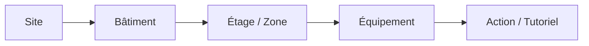
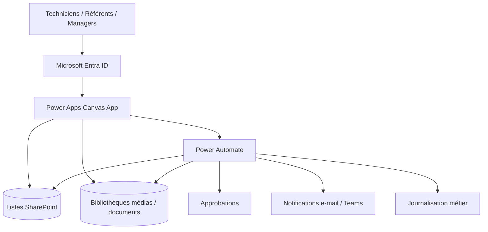
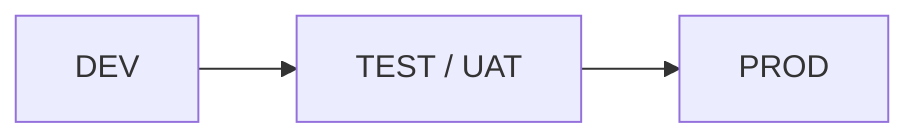

# Architecture entreprise — Building Operations Hub

[English](ARCHITECTURE.md) · [Français](ARCHITECTURE_FR.md)

## 1. Modèle opérationnel

L'application cible un environnement industriel multi-technique pouvant couvrir CVC, électricité, GTB/GTC, plomberie, SSI/incendie, ascenseurs, maintenance générale et prestataires spécialisés.

La connaissance opérationnelle est structurée selon la hiérarchie physique :

## 2. Architecture logique

## 3. Responsabilité Power Apps

Power Apps constitue la couche de présentation : navigation responsive, recherche, consultation des tutoriels, annuaire, barométrie, proposition de contenus et interfaces d'administration autorisées.

L'application n'est pas considérée comme la frontière de sécurité.

## 4. Responsabilité SharePoint

SharePoint centralise les données et références médias : Sites, Bâtiments, Zones, Équipements, Tutoriels, Types de tutoriels, Contacts, Types de contacts, Propositions, Demandes de changement, Feedback d'intervention et journal métier.

Les fichiers lourds restent dans des bibliothèques SharePoint plutôt que d'être intégrés dans la logique Canvas.

## 5. Responsabilité Power Automate

Les flows gèrent notamment :

- validation des données reçues de Canvas ;
- détermination du service/site responsable ;
- approbations ;
- publication contrôlée ;
- création/modification des contacts ;
- archivage et suppression gouvernée ;
- notifications et escalades ;
- journalisation ;
- anti-doublon et idempotence lorsque nécessaire.

## 6. Fiabilité

Le modèle production prévoit des chemins d'erreur explicites, des retries contrôlés, une concurrence limitée aux actions réellement indépendantes et l'évitement des mutations réseau massives ligne par ligne depuis Canvas.

## 7. ALM

Les valeurs propres à l'environnement sont externalisées via Environment Variables et Connection References. Les flows destinés au cycle de vie de la solution sont intégrés aux Solutions.

## 8. Limite portfolio

Le dépôt public montre l'architecture et le produit mais ne publie pas les formules, flows exportés, identifiants de listes, URLs de tenant ni configuration confidentielle.
