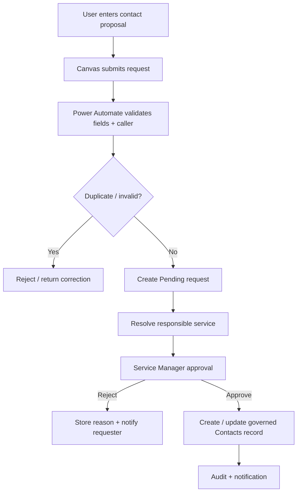
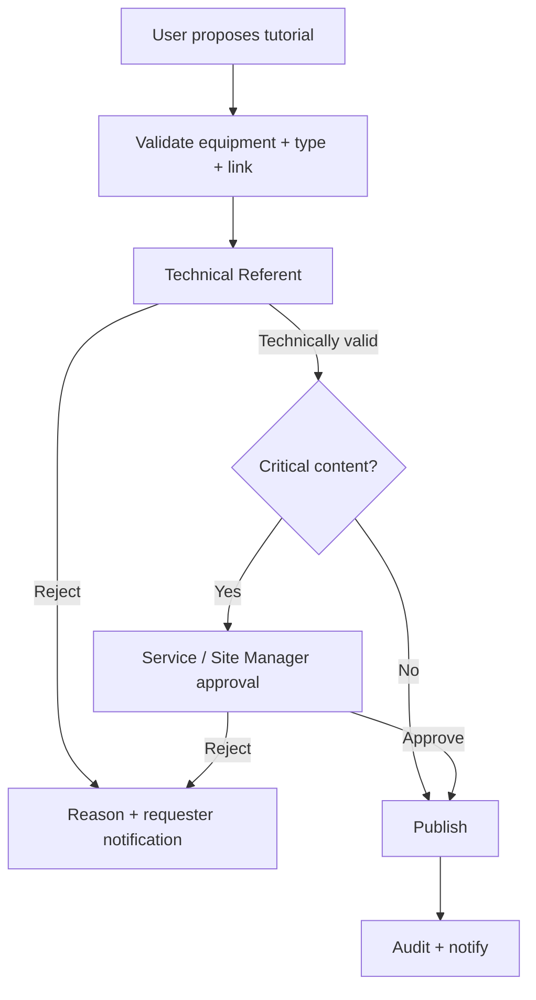
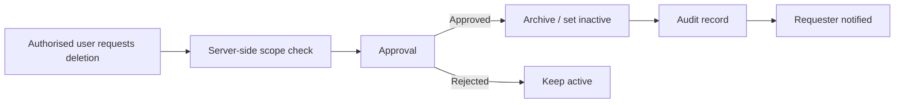

# Security, Roles & Approval Model

## Principle

The application follows a **least-privilege, role-based model**.

Power Apps controls what the user sees for usability, but actual authorisation is enforced through **Microsoft Entra ID, SharePoint permissions and server-side Power Automate validation**.

A hidden button is not considered a security control.

---

## Roles

### Technician / User
Can:

- browse authorised operational content;
- search contacts;
- view tutorials;
- submit barometry feedback;
- propose a new tutorial;
- request a new/updated contact.

Cannot directly publish or permanently delete governed records.

### Technical Referent
Can:

- technically validate tutorials for an assigned service/equipment family;
- review technical content quality;
- request corrections;
- approve low-risk technical content where governance allows.

### Service Manager
Can:

- approve contacts for the service;
- approve service-level content;
- approve archive/deletion requests within scope;
- manage business ownership for the service.

### Site Manager
Can:

- govern cross-service content;
- handle critical or site-wide approval;
- arbitrate ownership issues;
- approve sensitive requests according to policy.

### Functional Administrator
Can:

- maintain application configuration;
- maintain role/group mapping;
- administer reference data;
- support controlled operational administration.

This role is not intended to bypass business ownership.

---

## Example group model

```text
IND-App-Users
IND-CVC-Referents
IND-Electrical-Referents
IND-BMS-Referents
IND-FireSafety-Referents
IND-Service-Managers
IND-Site-Managers
IND-App-Functional-Admins
```

Permissions should be assigned through groups rather than individual ad-hoc grants wherever possible.

---

## New contact workflow



The user submitting the contact does not automatically gain the right to publish it.

---

## Tutorial workflow



Examples of content that may require stronger approval:

- electrical safety;
- lockout/tagout or isolation;
- fire-safety procedures;
- high-criticality equipment;
- cross-service operational instructions.

---

## Deletion / archive workflow

Direct delete from a public browsing screen is avoided.

The normal process is:



### Preferred behaviour

Instead of immediately destroying the record:

- `Active = false`;
- `Status = Archived`;
- retain archive date;
- retain who approved;
- retain business reason.

Physical deletion is reserved for explicit retention/data-governance rules.

---

## Power Automate server-side checks

Sensitive flows should not trust parameters sent by Canvas without validation.

Typical checks:

- caller identity;
- authorised service/site;
- target record existence;
- current record status;
- duplicate indicators;
- valid equipment/contact relationship;
- approval status;
- idempotency key where applicable.

---

## SharePoint security design

The target design prefers:

- site/list/library permissions through groups;
- controlled inheritance;
- minimal unique permissions;
- indexed columns for operational filtering;
- separate document/media library permissions when needed.

Very large numbers of per-item unique permissions are avoided as an architectural default.

---

## DLP and connections

Production governance should confirm:

- environment DLP policy;
- approved connectors;
- connection ownership;
- service accounts only where organisational policy allows;
- no secrets embedded in formulas;
- review of new connectors before production introduction.

---

## Auditability

For governed operations, the system records enough context to answer:

- who requested the change;
- what changed;
- when it changed;
- which service/site owned it;
- who approved/rejected it;
- why a deletion/archive occurred;
- whether notification succeeded.

The public portfolio demonstrates this **governance model** without exposing tenant-specific implementation details.
