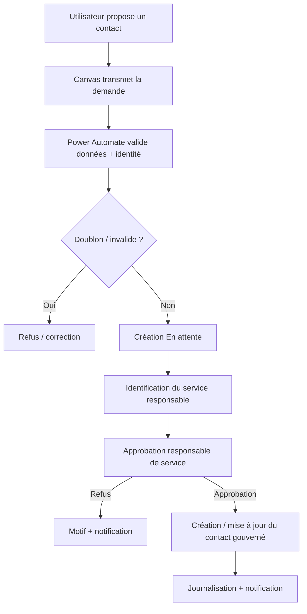
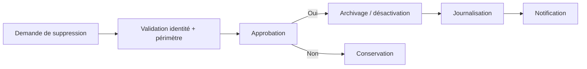

# Sécurité, rôles et approbations

[English](SECURITY_AND_APPROVALS.md) · [Français](SECURITY_AND_APPROVALS_FR.md)

## Principe

Le modèle cible applique le **moindre privilège** et des accès par rôle.

Power Apps peut adapter l'interface, mais l'autorisation réelle est imposée par **Microsoft Entra ID, les permissions SharePoint et la validation côté serveur dans Power Automate**.

Un bouton masqué n'est pas considéré comme un mécanisme de sécurité.

## Rôles

### Technicien / Utilisateur
- consultation du contenu autorisé ;
- recherche de contacts ;
- consultation des tutoriels ;
- saisie de la barométrie ;
- proposition d'un tutoriel ;
- demande de création/modification d'un contact.

Pas de publication ou suppression définitive directe.

### Référent technique
- validation technique des tutoriels de son périmètre ;
- contrôle de la qualité du contenu ;
- demande de correction ;
- validation des contenus à faible risque lorsque la gouvernance le permet.

### Responsable de service
- approbation des contacts du service ;
- approbation des contenus du service ;
- approbation des demandes d'archivage/suppression dans son périmètre.

### Responsable de site
- gouvernance transverse ;
- approbation des contenus critiques ;
- arbitrage sur les périmètres multi-services.

### Administrateur fonctionnel
- configuration de l'application ;
- mapping des rôles/groupes ;
- référentiels ;
- support et administration contrôlée.

## Ajout d'un contact

## Tutoriels

Une proposition de tutoriel est d'abord validée techniquement. Les contenus sensibles ou critiques peuvent nécessiter une seconde approbation par le responsable de service/site.

## Suppression

La suppression directe depuis une vue publique est évitée.

Processus cible :

L'archivage logique est préféré lorsque la traçabilité métier doit être conservée.

## DLP et connexions

Avant PROD, la gouvernance valide les connecteurs autorisés, les propriétaires des connexions, les politiques DLP, l'absence de secrets en dur et la conformité des flux aux règles de l'environnement.
