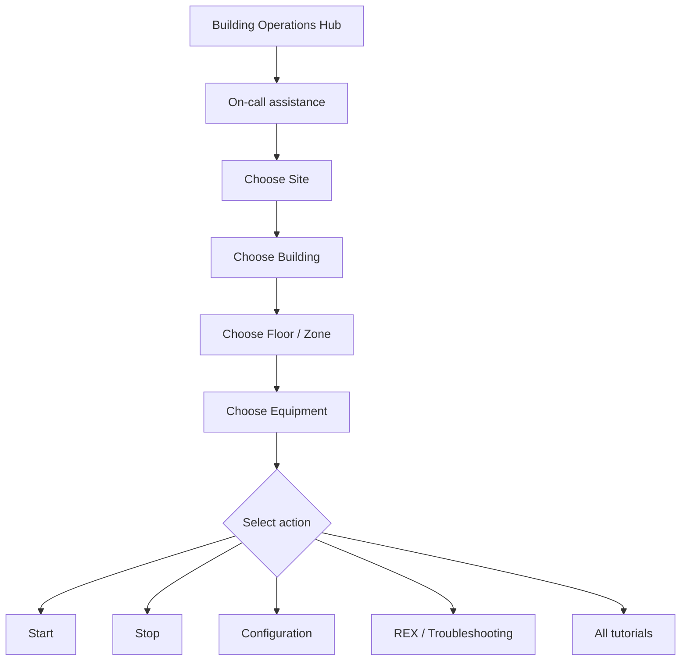
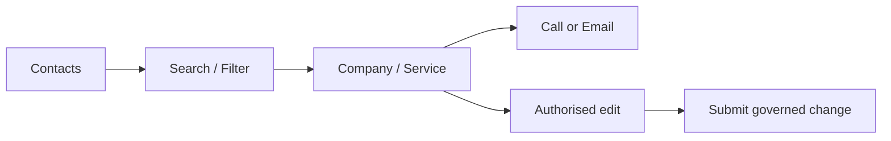
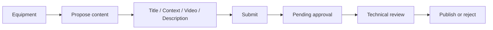
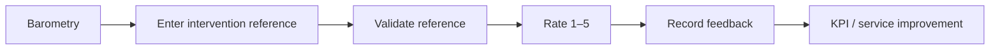

# User Journey

## Primary on-call journey

The objective is to minimise search time during an intervention and keep the technician inside the physical/technical context of the asset.

---

## Contact journey

Contacts can be classified by discipline/service and centrally managed through SharePoint.

---

## Content proposal journey

The proposal is not visible as approved operational content until the required validation is completed.

---

## Hot barometry journey

The portfolio uses a synthetic reference for demonstration. In an enterprise implementation, validation and storage are handled against the governed back end.
