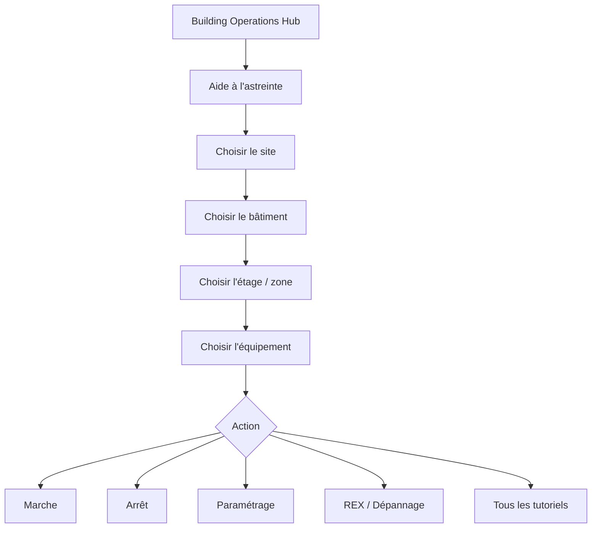
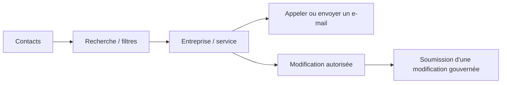
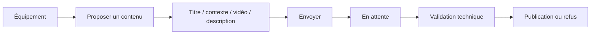
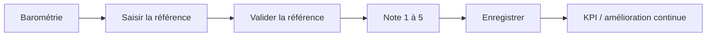

# Parcours utilisateur

[English](USER_JOURNEY.md) · [Français](USER_JOURNEY_FR.md)

## Parcours d'astreinte principal

## Annuaire

## Proposition de contenu

## Barométrie à chaud

La démonstration publique utilise des données synthétiques. Dans l'architecture entreprise, validation et stockage sont exécutés sur les sources gouvernées.
