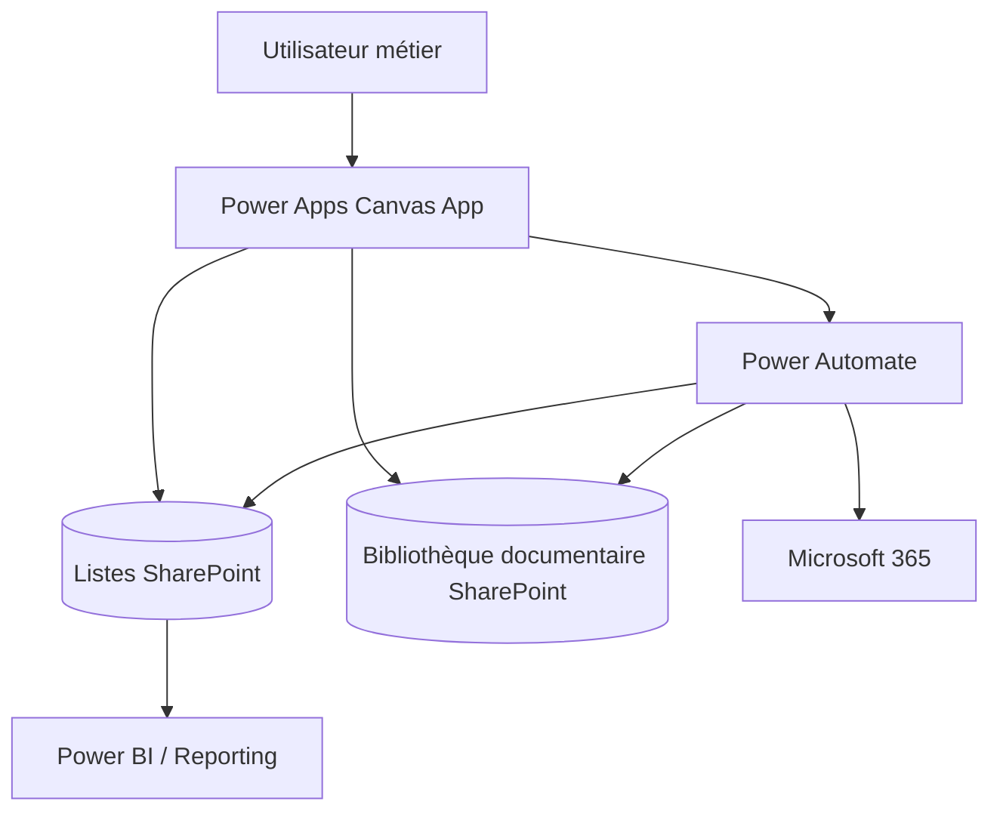

# ProcureFlow — Power Platform Procurement Workflow Portfolio

[English](#english) · [Français](#francais)

---

# 🇬🇧 English

> **Enterprise procurement and request-management workflow built around Power Apps, SharePoint and Power Automate.**

## Professional context

This project is a **sanitised portfolio reconstruction of an enterprise procurement/request workflow**.

It demonstrates how a business process can be structured across Canvas App UX, SharePoint data/document storage and Power Automate orchestration without exposing production source code or tenant configuration.

> Production `.msapp`, Power Fx implementation details, real flows, tenant identifiers and confidential business data are intentionally not published.

## Business objective

Centralise procurement and operational requests from creation through closure:

**Create → Review → Assign team + owner → Accept → Process → Documents / Comments / Status → Close & Archive**

## Main functional areas

| Area | Purpose |
|---|---|
| Request creation | Structured forms by request type |
| Review | Final validation before submission |
| Assignment | Team + named owner |
| Work queues | Personal and service ticket views |
| Request detail | Status, comments, history and stakeholders |
| Documents | Durable SharePoint document association |
| Notifications | Lifecycle e-mails / collaboration |
| Team management | Membership and access administration |
| Closure | Controlled end state and archive behaviour |

## Architecture

## Key capabilities demonstrated

| Area | Capability |
|---|---|
| Power Apps | Multi-step enterprise workflow UX |
| Power Automate | Server-side lifecycle orchestration |
| SharePoint | Business records, teams, stakeholders and documents |
| Security | Least privilege and source-layer permissions |
| Reliability | Error paths, idempotency and duplicate-prevention principles |
| Performance | Delegation-aware source-side design |
| ALM | DEV → TEST/UAT → PROD with Solutions and environment configuration |
| Portfolio privacy | Architecture shown without distributing production source |

## Documentation

- [Architecture](./docs/ARCHITECTURE.md)
- [Functional scope](./docs/FEATURES.md)
- [Security, reliability & ALM](./docs/SECURITY_AND_ALM.md)

---

# 🇫🇷 Français

> **Workflow d'entreprise de gestion des demandes achats construit autour de Power Apps, SharePoint et Power Automate.**

## Contexte professionnel

Ce projet est une **reconstruction portfolio anonymisée d'un workflow d'entreprise de gestion des demandes achats**.

Il démontre comment structurer un processus métier entre UX Canvas App, stockage SharePoint et orchestration Power Automate, sans exposer le code source de production ni la configuration du tenant.

> Le `.msapp` de production, les détails Power Fx, flows réels, identifiants du tenant et données métier confidentielles ne sont volontairement pas publiés.

## Objectif métier

Centraliser les demandes de la création jusqu'à la clôture :

**Création → Vérification → Affectation équipe + personne → Acceptation → Traitement → Documents / Commentaires / Statut → Clôture & Archivage**

## Principaux domaines fonctionnels

| Domaine | Objectif |
|---|---|
| Création | Formulaires structurés selon le type |
| Vérification | Validation finale avant envoi |
| Affectation | Équipe + propriétaire nommé |
| Files de travail | Tickets personnels et du service |
| Détail | Statut, commentaires, historique et parties prenantes |
| Documents | Rattachement durable aux bibliothèques SharePoint |
| Notifications | E-mails et événements de cycle de vie |
| Gestion d'équipe | Membres et droits |
| Clôture | État final et archivage contrôlé |

## Architecture

## Compétences démontrées

**Power Apps · Power Automate · SharePoint · Délégation · Sécurité · Gestion des erreurs · Idempotence · ALM · Solutions · Connection References · Environment Variables**

## Documentation

- [Architecture](./docs/ARCHITECTURE_FR.md)
- [Périmètre fonctionnel](./docs/FEATURES_FR.md)
- [Sécurité, fiabilité & ALM](./docs/SECURITY_AND_ALM_FR.md)

Le code source de production reste privé.
