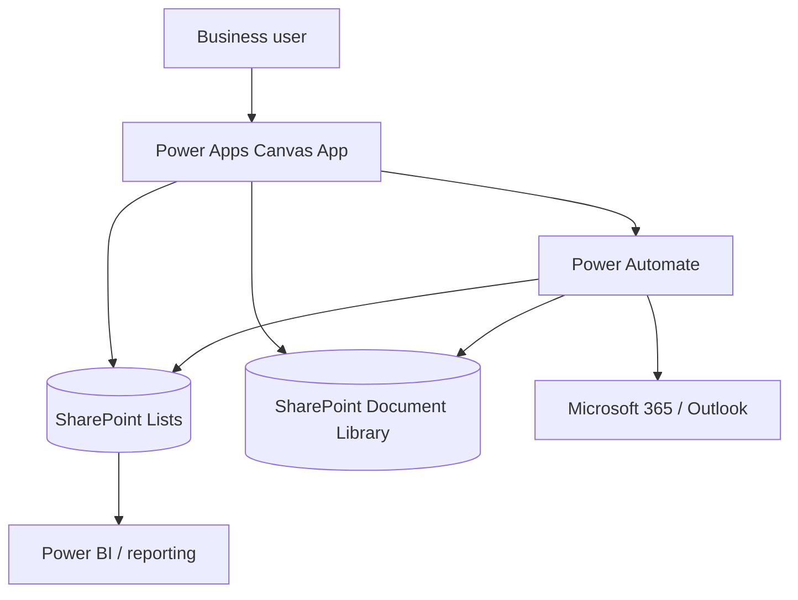

# ProcureFlow — Power Platform Procurement Workflow Case Study

[**English**](README.md) · [**Français**](README_FR.md)

A **sanitised portfolio reconstruction of an enterprise procurement and request-management platform** built with Microsoft Power Platform.

> Production `.msapp`, real flows, tenant identifiers, suppliers, user data and confidential implementation details are intentionally not published.

---

## Business scope

The platform centralises:

- request creation;
- business validation;
- final review before submission;
- assignment to a team and individual owner;
- ticket acceptance and processing;
- personal and team work queues;
- request detail and history;
- documents;
- notifications and stakeholder visibility;
- team/access management;
- closure and archive behaviour.

---

## Architecture

The public repository focuses on architecture, UX and engineering principles rather than production source.

---

## Engineering principles

- delegation-aware source-side filtering;
- explicit write/error handling;
- reduced network fan-out;
- controlled state/navigation;
- SharePoint permissions as the real data-security boundary;
- server-side validation of sensitive flow inputs;
- idempotency and duplicate-prevention considerations;
- DEV → TEST/UAT → PROD ALM;
- Solutions, Connection References and Environment Variables;
- App/Solution Checker, Monitor and regression-test expectations.

---

## Documentation

- [Architecture](docs/ARCHITECTURE.md)
- [Functional scope](docs/FEATURES.md)
- [Security, reliability & ALM](docs/SECURITY_AND_ALM.md)

Screenshot and demo folders are kept under this project only:

- [assets/](assets/)
- [demo/](demo/)

No Power Fx implementation samples are published in this portfolio.
