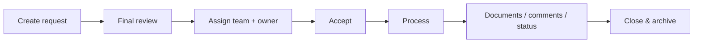

# ProcureFlow

> **Power Apps · Power Automate · SharePoint · Procurement workflow**

[← Main portfolio](../../README.md) · [▶ Power Apps demo](https://www.youtube.com/watch?v=Y15BCn_i-fo) · [📊 Power BI portfolio](https://github.com/jeffersonkuku/powerbi-portfolio-projects) · [🇫🇷 Français](#francais)

## 30-second overview

**Business problem:** procurement and internal requests can become difficult to track when creation, assignment, documents, notifications and ownership are spread across different tools.

**Solution:** one structured workflow covering the full request lifecycle:

**Create → Review → Assign team + owner → Accept → Process → Documents / Comments / Status → Close & Archive**

**Stack:** Power Apps Canvas · Power Automate · SharePoint · Microsoft 365

**Main capabilities:** structured request forms, final validation, personal/team queues, assignment, lifecycle notifications, durable document association, team management and controlled closure.

---

## Workflow

## What this case study demonstrates

| Area | Capability |
|---|---|
| **Power Apps** | Multi-step business workflow and request-management UX |
| **Power Automate** | Lifecycle orchestration, notifications and controlled server-side actions |
| **SharePoint** | Request data, team information, stakeholders and document association |
| **Security design** | Least privilege and source-layer permissions |
| **Reliability design** | Error paths, duplicate prevention and idempotency considerations |
| **Performance design** | Delegation-aware, source-side filtering patterns |
| **ALM design** | DEV → TEST/UAT → PROD with Solutions and environment configuration |

## Functional scope

### Request creation

Users create a request through a form adapted to the selected request type and required business information.

### Final review

Before submission, the user sees a consolidated summary so key information can be checked before the request enters the workflow.

### Assignment

A request is assigned to both a **team** and a **named owner**, giving clear operational responsibility.

### Personal and team queues

Users can distinguish requests they own from requests visible to their service or team.

### Request detail

The detail view centralises current status, comments, stakeholders, history and related actions.

### Documents

Documents remain associated with the request through the lifecycle instead of being treated as temporary attachments only.

### Notifications

Power Automate patterns support creation, assignment, status-change and closure notifications.

### Team management

Team membership and access are managed separately from the operational ticket flow.

### Closure

The workflow ends in a controlled final state with archive behaviour rather than an ambiguous completed status.

## Architecture

## Engineering documentation

- [Architecture](./docs/ARCHITECTURE.md)
- [Functional scope](./docs/FEATURES.md)
- [Security, reliability & ALM](./docs/SECURITY_AND_ALM.md)

## Public portfolio boundary

This public case study focuses on the business process, architecture and engineering approach.

Production `.msapp` packages, tenant-specific Power Fx implementation, live flow exports, tenant identifiers and confidential business data are intentionally not published.

---

# 🇫🇷 Français

## Vue en 30 secondes

**Problème métier :** centraliser les demandes achats et internes afin de maîtriser la création, l'affectation, les documents, les notifications et la responsabilité de traitement.

**Parcours :**

**Création → Vérification → Affectation équipe + personne → Acceptation → Traitement → Documents / Commentaires / Statut → Clôture & Archivage**

**Technologies :** Power Apps Canvas · Power Automate · SharePoint · Microsoft 365

## Fonctionnalités principales

- formulaires structurés selon le type de demande ;
- vérification finale avant envoi ;
- affectation équipe + propriétaire ;
- files personnelles et service ;
- suivi du statut et de l'historique ;
- rattachement durable des documents ;
- notifications de cycle de vie ;
- gestion des équipes et accès ;
- clôture contrôlée.

## Ce que le projet démontre

**Power Apps · Power Automate · SharePoint · Délégation · Sécurité · Gestion des erreurs · Idempotence · Documents · Notifications · ALM**

## Documentation

- [Architecture FR](./docs/ARCHITECTURE_FR.md)
- [Périmètre fonctionnel FR](./docs/FEATURES_FR.md)
- [Sécurité, fiabilité & ALM FR](./docs/SECURITY_AND_ALM_FR.md)

La version publique documente la logique métier et l'architecture sans exposer les éléments confidentiels de production.
