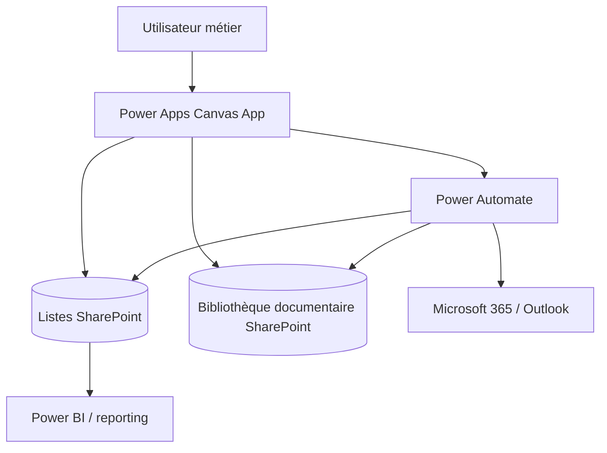

# ProcureFlow — Étude de cas Power Platform Achats & Demandes

[**English**](README.md) · [**Français**](README_FR.md)

Reconstruction **anonymisée** d'une plateforme d'entreprise de gestion des achats et des demandes réalisée avec Microsoft Power Platform.

> Le `.msapp` de production, les flows réels, identifiants du tenant, fournisseurs, utilisateurs et règles confidentielles ne sont volontairement pas publiés.

---

## Périmètre métier

La plateforme centralise :

- création des demandes ;
- validations métier ;
- vérification finale avant envoi ;
- affectation à une équipe et à un propriétaire ;
- prise en charge ;
- files personnelles et d'équipe ;
- détail et historique ;
- documents ;
- notifications et visibilité des parties prenantes ;
- gestion des équipes et accès ;
- clôture et archivage.

---

## Architecture

Le dépôt public met l'accent sur l'architecture, l'UX et les principes d'ingénierie sans distribuer la source de production.

---

## Principes techniques

- requêtes délégables et traitement côté source ;
- gestion explicite des erreurs d'écriture ;
- réduction du fan-out réseau ;
- état/navigation contrôlés ;
- permissions SharePoint comme véritable frontière d'accès aux données ;
- validation serveur des paramètres sensibles transmis aux flows ;
- prise en compte de l'idempotence et des doublons ;
- ALM DEV → TEST/UAT → PROD ;
- Solutions, Connection References et Environment Variables ;
- App/Solution Checker, Monitor et tests de non-régression.

---

## Documentation

- [Architecture](docs/ARCHITECTURE.md)
- [Périmètre fonctionnel](docs/FEATURES.md)
- [Sécurité, fiabilité & ALM](docs/SECURITY_AND_ALM.md)

Les dossiers de captures et de démonstration sont regroupés uniquement dans ce projet :

- [assets/](assets/)
- [demo/](demo/)

Aucun exemple d'implémentation Power Fx n'est publié dans ce portfolio.
