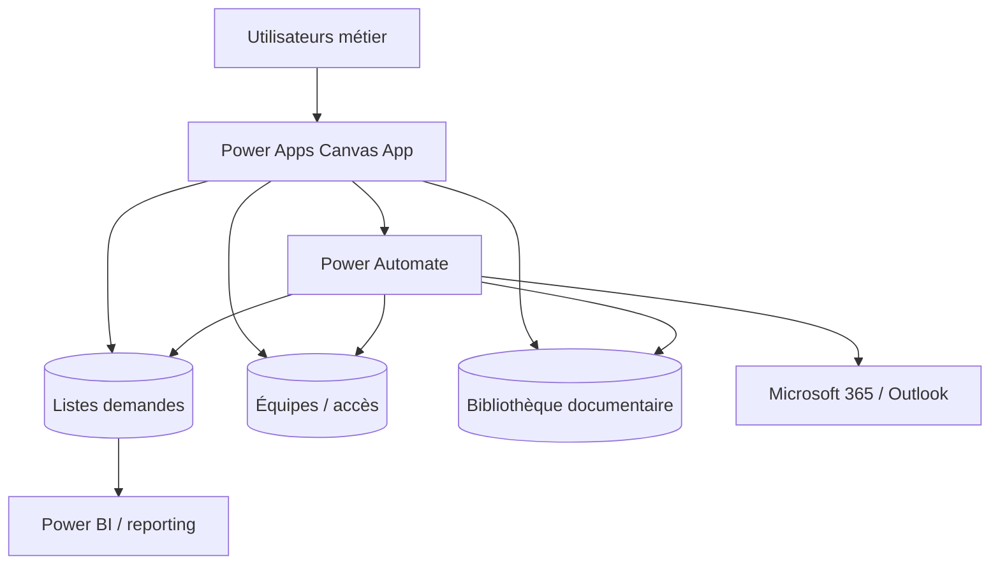

# Architecture de la solution — ProcureFlow

[English](ARCHITECTURE.md) · [Français](ARCHITECTURE_FR.md)

ProcureFlow est présenté comme une solution Power Platform multi-couche, et non comme une simple application Canvas.

## Responsabilités

### Power Apps
Navigation, formulaires, validation côté client, files de tickets, détails, documents et interactions utilisateur.

### SharePoint
Stockage structuré des demandes, équipes, membres, parties prenantes, historique et configuration. Les requêtes distantes doivent rester délégables et s'appuyer sur des colonnes indexées lorsque nécessaire.

### Bibliothèque SharePoint
Les documents sont séparés des métadonnées de demande et associés via un identifiant stable.

### Power Automate
Notifications, opérations documentaires, transmission, événements de cycle de vie, archivage, validation serveur et logique anti-doublon.

### Microsoft 365
Collaboration et notifications lorsque la politique de l'environnement l'autorise.

## Principe de sécurité

L'interface Power Apps n'est pas la frontière de sécurité. Les permissions sur les sources, groupes et services associés imposent les accès réels.

## ALM

La cible est **DEV → TEST/UAT → PROD** avec Solutions, Connection References et Environment Variables.
