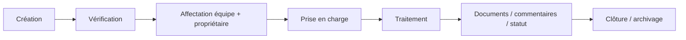

# Périmètre fonctionnel — ProcureFlow

[English](FEATURES.md) · [Français](FEATURES_FR.md)

## Modules principaux

- Accueil et navigation persistante
- Statistiques / reporting
- Mes tickets
- Tickets du service
- Création d'une demande
- Vérification avant envoi
- Affectation équipe + personne
- Prise en charge
- Détail de la demande
- Documents
- Parties prenantes / copies
- Historique et commentaires
- Gestion des équipes
- Paramètres / administration
- Clôture et archivage

## Types de demandes

Le formulaire peut s'adapter au contexte métier tout en conservant un cycle commun, par exemple :

- création d'un article / part ;
- demande de soumission ;
- création de PO ;
- achat hors catalogue ;
- suivi ;
- autre demande.

## Cycle de vie

Le détail de ticket reste l'espace de travail opérationnel central.
