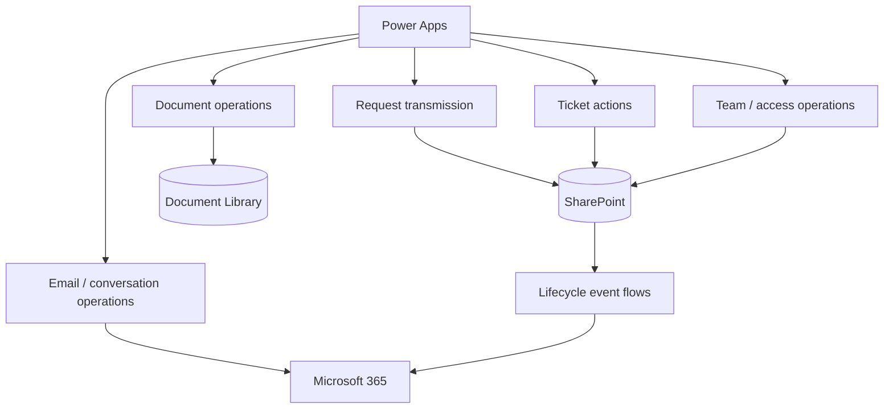

# Power Automate Architecture — Sanitised Portfolio View

This document describes the **workflow responsibilities** demonstrated by the solution without publishing production flow exports, connector IDs, tenant URLs or confidential business rules.

## Flow families



## 1. Request transmission

Responsibilities can include:

- validating the submitted business payload;
- creating or finalising the request record;
- associating documents with the request;
- setting the initial workflow state;
- recording a lifecycle event;
- triggering the appropriate notification path.

The Canvas App should receive a small, predictable response contract such as success/failure and the created request identifier rather than needing to reproduce server logic locally.

## 2. Ticket actions

Ticket-action flows can centralise operations such as:

- accept request;
- reassign owner;
- change state;
- close request;
- archive request.

Sensitive transitions should be revalidated server-side instead of trusting only controls hidden or disabled in the Canvas App.

## 3. Document operations

Document-oriented flows can handle:

- request-folder creation;
- document association;
- file metadata;
- draft-to-final attachment handling;
- safe retrieval of document links.

The design goal is to keep documents durable throughout the ticket lifecycle rather than depending on temporary client state.

## 4. Email and conversation operations

Email-related workflows can support:

- initial request notifications;
- status-change notifications;
- requester notifications;
- copied-stakeholder notifications;
- conversation search / association patterns.

The public demo simulates these experiences and does not access a real mailbox.

## 5. Team and access operations

Administrative workflows can coordinate:

- team membership updates;
- transfers;
- delegation records;
- access-related validation.

Actual data-source permissions must remain the enforcement layer.

---

# Reliability patterns

## Structured scopes

A production flow should separate meaningful stages, for example:

```text
TRY
 ├─ Validate input
 ├─ Read current state
 ├─ Apply business operation
 └─ Write audit event

CATCH
 ├─ Capture failure information
 └─ Return controlled error

FINALLY
 └─ Final telemetry / cleanup where required
```

## Idempotency

Retried operations should not create duplicate requests, documents or notifications. A stable business key or operation identifier can be used where the process requires retry protection.

## Concurrency

Concurrency should only be enabled where iterations or branches are independent and the target system can safely support parallel operations.

## Trigger conditions

Event-driven flows should use trigger conditions or equivalent guards where appropriate to avoid unnecessary runs and self-recursion.

## Error contract back to Power Apps

A Canvas-triggered operation should return a controlled result rather than forcing the app to infer success from side effects.

Illustrative response shape:

```json
{
  "success": true,
  "requestId": 1001,
  "message": "Request processed successfully"
}
```

This is a documentation example only; it is not a production payload.

---

# ALM considerations

Production cloud flows should be solution-aware and use environment-specific configuration rather than hard-coded DEV/TEST/PROD endpoints.

Relevant Microsoft Learn references:

- https://learn.microsoft.com/en-us/power-platform/alm/overview-alm
- https://learn.microsoft.com/en-us/power-platform/alm/solution-concepts-alm
- https://learn.microsoft.com/en-us/power-apps/maker/data-platform/environmentvariables

---

# Why production flows are not public

Publishing the original flow exports would add little value for a recruiter while increasing the risk of exposing:

- tenant structure;
- internal list names;
- email addresses;
- connector metadata;
- environment IDs;
- proprietary business logic.

The portfolio therefore documents the **architecture and engineering decisions** while the complete sanitised solution can be demonstrated privately when appropriate.
