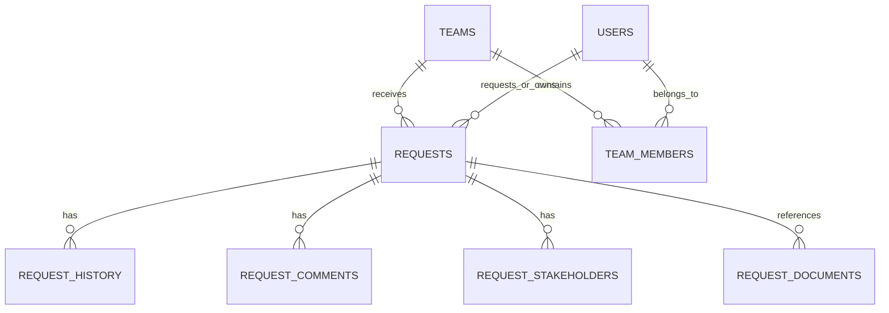

# SharePoint Data Model — Portfolio Schema

This is a **sanitised conceptual schema** for the portfolio. It describes the main entities and relationships without reproducing production list names, internal IDs or tenant configuration.

## Core entities

---

## 1. Requests

Purpose: main business record for each procurement/request ticket.

Representative fields:

| Field | Type | Purpose |
|---|---|---|
| `Title` | Single line text | Human-readable request title |
| `RequestNumber` | Single line text | Stable business identifier |
| `RequestType` | Choice / text | Type of procurement request |
| `Requester` | Person / reference | User who created the request |
| `AssignedTeamId` | Number / lookup | Destination team |
| `AssignedOwner` | Person / reference | Current owner |
| `Status` | Choice / text | Lifecycle state |
| `Urgency` | Choice / text | Business urgency |
| `Description` | Multiple lines | Request description |
| `Created` | Date/time | Creation timestamp |
| `Modified` | Date/time | Last update timestamp |
| `ClosedAt` | Date/time | Closure timestamp where applicable |

Production field types should be selected according to delegation, reporting, permissions and maintainability requirements.

---

## 2. Teams

Purpose: defines the operational teams that can receive requests.

Representative fields:

| Field | Type |
|---|---|
| `Title` | Single line text |
| `TeamCode` | Single line text |
| `Active` | Yes/No |
| `Manager` | Person / reference |

---

## 3. Team members

Purpose: maps users to teams and supports membership or role logic.

Representative fields:

| Field | Type |
|---|---|
| `TeamId` | Number / lookup |
| `Member` | Person / reference |
| `Role` | Choice / text |
| `Active` | Yes/No |
| `ValidFrom` | Date/time |
| `ValidTo` | Date/time |

A user can have more than one membership where the business model requires it.

---

## 4. Request stakeholders

Purpose: stores copied stakeholders who need visibility without becoming the request owner.

Representative fields:

| Field | Type |
|---|---|
| `RequestId` | Number / lookup |
| `Stakeholder` | Person / reference |
| `ReadOnly` | Yes/No |
| `NotifyOnStatusChange` | Yes/No |

---

## 5. Request comments

Purpose: collaboration messages associated with a request.

Representative fields:

| Field | Type |
|---|---|
| `RequestId` | Number / lookup |
| `Comment` | Multiple lines |
| `Author` | Person / reference |
| `Created` | Date/time |

Comments should not replace system audit history.

---

## 6. Request history

Purpose: records meaningful lifecycle events for traceability.

Representative fields:

| Field | Type |
|---|---|
| `RequestId` | Number / lookup |
| `EventType` | Choice / text |
| `PreviousValue` | Multiple lines / text |
| `NewValue` | Multiple lines / text |
| `PerformedBy` | Person / reference |
| `EventDate` | Date/time |

---

## 7. Delegations / access

Purpose: represents temporary access or responsibility delegation where required.

Representative fields:

| Field | Type |
|---|---|
| `User` | Person / reference |
| `Delegate` | Person / reference |
| `TeamId` | Number / lookup |
| `StartDate` | Date/time |
| `EndDate` | Date/time |
| `Active` | Yes/No |

---

# Documents

Documents are better represented as files in a **SharePoint document library** rather than duplicating binary content inside business-list records.

Representative metadata can include:

| Metadata | Purpose |
|---|---|
| `RequestId` | Associates the file with the ticket |
| `RequestNumber` | Human-readable reference |
| `DocumentCategory` | Type of supporting document |
| `UploadedBy` | Uploader |
| `UploadedAt` | Upload timestamp |

---

# Scale and query considerations

The portfolio architecture assumes that production queries are designed around indexed/filterable fields and delegation-aware Power Fx patterns.

The SharePoint list-view threshold should not be interpreted as the maximum number of items that a list can contain. Instead, list design, indexed columns, views and query patterns must be planned so that operations remain efficient at scale.

The public demo intentionally uses a small synthetic local dataset and therefore should not be used as evidence of production query performance.

---

# Security note

Hiding a control or filtering records in Power Apps is **not** a substitute for SharePoint permissions. Production access needs to be enforced through the source/service security model and organisational governance.
